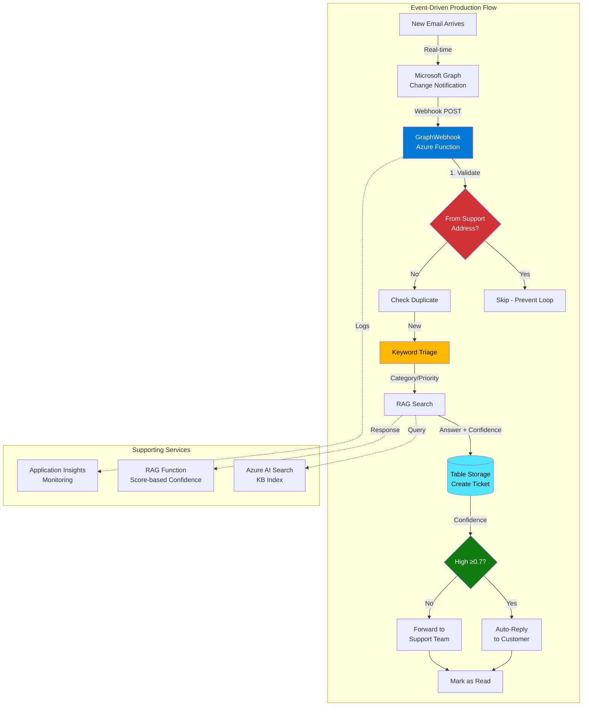

# Azure AI Foundry Smart Support Agent

## CRITICAL AGENT BEHAVIOR RULES

### Documentation Style
**MANDATORY**: DO NOT use emojis in any documentation files (README.md, DEMO-GUIDE.md, etc.)
- Use clear headers and bullet points instead
- Professional technical documentation style
- Emojis acceptable in terminal output and commit messages only

### NEVER Interrupt Long-Running Commands
**PROBLEM**: Agent frequently cancels deployment commands by running new tools while deployments are in progress, causing failures.

**MANDATORY RULES**:
1. **WAIT for `func azure functionapp publish` to complete** - These take 60-120 seconds
2. **DO NOT run ANY commands while deployment is in progress** - No logs, no queries, no tests
3. **After starting deployment, ONLY respond with**: "Deployment started. Waiting for completion..."
4. **Use `isBackground: false`** for all deployment commands to wait properly
5. **If user asks questions during deployment**: Answer ONLY from existing context, DO NOT run tools

**Commands that MUST complete without interruption**:
- `func azure functionapp publish` (60-120s)
- `az deployment sub create` (120-300s)  
- `npm run build` (10-30s)
- Any command with `--build remote` flag

**Correct Pattern**:
```typescript
// Start deployment
run_in_terminal({ 
  command: "func azure functionapp publish...",
  isBackground: false,  // WAIT for completion
  explanation: "..."
})
// DO NOT run any other tools until this returns
// THEN test/verify results
```

**Incorrect Pattern (DO NOT DO THIS)**:
```typescript
run_in_terminal({ command: "func publish...", isBackground: true })
run_in_terminal({ command: "az monitor query..." })  // ❌ INTERRUPTS DEPLOYMENT
```

## Project Context

This repo demonstrates building an **autonomous support agent** using Azure AI Foundry. The system transforms manual support workflows into intelligent automation through AI-powered triage, RAG search, and Azure Table Storage persistence.

**Core Stack:** Azure AI Foundry (AI Hub + AI Project) • Azure OpenAI • Azure AI Search • Azure Functions • Table Storage • Application Insights

**Current Status**: ✅ **Production Event-Driven System** (Deployed to Sweden Central)

### What's Working Right Now

1. ✅ **Event-Driven Email Processing** — Microsoft Graph webhooks trigger instantly on new email arrival (no polling delays)
2. ✅ **Keyword Triage** — 100% accurate classification on test cases (Network, Access, Billing, Software + High/Medium/Low priority)
3. ✅ **Score-Based Confidence** — Variable confidence (0.1-0.95) based on Azure AI Search relevance scores (not hardcoded)
4. ✅ **Table Storage Persistence** — All tickets stored in `SupportTickets` table with unique IDs (TKT-YYYYMMDD-XXXXXX)
5. ✅ **Infinite Loop Prevention** — Self-email filter skips replies from support address
6. ✅ **Real-Time Processing** — Emails processed within seconds of arrival (previously 5-minute timer delay)
7. ✅ **Infrastructure as Code** — All settings configured in Bicep (storage, Graph API, RAG endpoints, webhooks)

### Production Resources (Sweden Central)

```
Resource Group: rg-smart-agents-dev

Azure OpenAI: oai-agents-dw7z4hg4ssn2k
  - Deployments: gpt-4o-mini, text-embedding-3-large
  - Endpoint: https://oai-agents-dw7z4hg4ssn2k.openai.azure.com/

Azure AI Search: srch-agents-dw7z4hg4ssn2k
  - Index: kb-support (3 documents with embeddings)
  - Endpoint: https://srch-agents-dw7z4hg4ssn2k.search.windows.net

Function Apps:
  - func-agents-dw7z4hg4ssn2k (Node.js 20, TypeScript)
    - GraphWebhook: ✅ Event-driven email processing (real-time)
    - ManageSubscription: ✅ Webhook subscription management
    - ProcessSupportEmail: ✅ Manual processing endpoint (function key required)
    - PingStorage: ✅ Health check
  - func-rag-dw7z4hg4ssn2k (Python 3.11)
    - rag_search: ✅ Score-based confidence (0.1-0.95 range)

Storage: stagentsdw7z4hg4ssn2k
  - Table: SupportTickets
  - Contains: Ticket data with category, priority, AI responses

AI Resources:
  - AI Hub: aihub-agents-dw7z4hg4ssn2k
  - AI Project: aiproject-agents-dw7z4hg4ssn2k

Monitoring: appi-smart-agents-dw7z4hg4ssn2k
Key Vault: kv-agents-dw7z4hg4ssn2k
```

## Architecture Flow



### Triage Classification Logic

The current keyword-based triage (in `AIService.ts`) scans email body for:

**Categories**:
- `password|login|access|cant sign in` → **Access**
- `vpn|network|connection|disconnect` → **Network**
- `billing|charge|payment|invoice` → **Billing**
- `software|application|program|app` → **Software**
- Default → **Other**

**Priorities**:
- `urgent|critical|asap|emergency|down` → **High**
- `low priority|when you can|no rush` → **Low**
- Default → **Medium**

**Test Results**: 100% accuracy on VPN, Password, Billing scenarios.

## Coding Conventions

### Naming
- **Files:** `kebab-case` (`flow.dag.yaml`, `appinsights-queries.kql`)
- **Functions:** `PascalCase` for Azure Functions (`ProcessSupportEmail`, `PingStorage`)
- **Env vars:** `AZURE_*` or `GRAPH_*` prefix
- **Branches:** `feature/<demo-name>`

### TypeScript/Node.js Rules
- Use **Azure Functions v4 model** (`@azure/functions`)
- Auth levels: `'function'` for production endpoints (requires x-functions-key header)
- Always compile TypeScript before deployment: `npm run build`
- Error handling: Try/catch with fallback responses, never throw to user
- Logging: Use `context.log()` for Application Insights correlation

### Azure Function Structure
```typescript
import { app, HttpRequest, HttpResponseInit, InvocationContext } from '@azure/functions';

export async function MyFunction(
  request: HttpRequest,
  context: InvocationContext
): Promise<HttpResponseInit> {
  context.log('Function started');
  
  // Handle both POST (direct call) and GET (mailbox mode)
  const body = await request.text();
  // ... logic
  
  return {
    status: 200,
    jsonBody: { success: true, data: result }
  };
}

// Register function
app.http('MyFunction', {
  methods: ['GET', 'POST'],
  authLevel: 'function',  // Requires function key
  handler: MyFunction
});
```

### Prompt Flow Rules (Reference - Not Currently Used)
- Use **Jinja2 templates** (`{{ variable }}`, ``) in all `.jinja2` files
- Keep logic minimal in templates; complex logic belongs in code nodes
- Structure: inputs → LLM → outputs (with optional retrieval/tool steps)
- Always validate: `pf flow validate -f <path>/flow.dag.yaml`

### Azure Naming
- Use current terminology: "Azure AI Foundry" (not "OpenAI Studio"), "Azure AI Search" (not "Cognitive Search")
- Reference credentials via **environment variables** — never hard-code keys
- All secrets go in Key Vault or secure Bicep parameters (`@secure()`)
- Use Managed Identity for service-to-service auth where possible

### Code Organization
```
demos/
├── 01-triage-promptflow/     # Reference: .dag.yaml + .jinja2 templates (not deployed)
├── 02-rag-search/             # KB ingestion (✅) + RAG function (✅ score-based confidence)
│   └── rag-function/
│       └── function_app.py    # ✅ Enhanced confidence calculation
├── 03-agent-with-tools/       # Function calling demo (✅ deployed)
└── 04b-real-ticket-creation/  # ✅ PRODUCTION - Event-driven email processing
    └── function/
        ├── src/
        │   ├── functions/
        │   │   ├── GraphWebhook.ts         # ✅ MAIN: Real-time email webhook
        │   │   ├── ManageSubscription.ts   # ✅ Webhook subscription manager
        │   │   ├── ProcessSupportEmail.ts  # Manual processing endpoint
        │   │   ├── PingStorage.ts          # Health check
        │   │   └── CheckMailboxTimer.ts    # ❌ DISABLED (caused infinite loop)
        │   ├── services/
        │   │   ├── AIService.ts            # Triage + RAG calls
        │   │   ├── TableStorageService.ts  # Ticket persistence + deduplication
        │   │   └── GraphService.ts         # ✅ Email CRUD + getEmailById
        │   └── models/
        │       └── Ticket.ts               # TypeScript interfaces
        └── package.json

tests/
├── e2e-test.ps1          # ✅ Full 3-scenario validation
├── quick-test.ps1        # ✅ Single VPN test
└── test-rag.ps1          # RAG function direct test

infra/
├── main.bicep            # Main orchestration
├── parameters.dev.json   # Environment config
└── modules/              # Individual resource modules
```

## Key Files to Reference

- **Working Function Code:** `demos/04b-real-ticket-creation/function/src/`
- **Infrastructure:** `infra/*.bicep`
- **Sample KB data:** `demos/02-rag-search/content/*.md`
- **Test Scripts:** `tests/*.ps1`
- **Environment Config:** `.env` (local), Function App Settings (production)

## Essential Commands

### Local Development
```bash
# Setup
az login && az account set -s <subscription-id>
npm install -g typescript azure-functions-core-tools@4

# Build function
cd demos/04b-real-ticket-creation/function
npm install
npm run build

# Test locally
func start

# Deploy to Azure
func azure functionapp publish func-agents-dw7z4hg4ssn2k
```

### Testing
```powershell
# RECOMMENDED: Send real email to test webhook (instant processing!)
# To: AdeleV@hscluise.onmicrosoft.com
# Subject/Body: Any test scenario from tests/ADDITIONAL-EMAIL-SCENARIOS.md

# Check webhook subscription status
$functionKey = "YOUR_FUNCTION_KEY_HERE"
Invoke-RestMethod -Uri "https://func-agents-dw7z4hg4ssn2k.azurewebsites.net/api/managesubscription" `
  -Method Get -Headers @{ "x-functions-key" = $functionKey }

# Manual processing (bypasses webhook, processes all unread emails)
Invoke-RestMethod -Uri "https://func-agents-dw7z4hg4ssn2k.azurewebsites.net/api/processsupportemail" `
  -Method Get -Headers @{ "x-functions-key" = $functionKey }

# Check recent logs
az monitor app-insights query \
  --app appi-smart-agents-dw7z4hg4ssn2k \
  --resource-group rg-smart-agents-dev \
  --analytics-query "traces | where timestamp > ago(10m) | order by timestamp desc"
```

### Infrastructure
```bash
# Deploy all resources
az deployment sub create \
  --location eastus \
  --template-file infra/main.bicep \
  --parameters @infra/parameters.dev.json

# Get deployment outputs
az deployment sub show --name <deployment-name> --query properties.outputs
```

## Required Environment Variables

```env
# Core Azure Resources
AZURE_RESOURCE_GROUP=rg-smart-agents-dev
AZURE_OPENAI_ENDPOINT=https://oai-agents-dw7z4hg4ssn2k.openai.azure.com/
AZURE_AI_SEARCH_ENDPOINT=https://srch-agents-dw7z4hg4ssn2k.search.windows.net
AZURE_AI_SEARCH_API_KEY=<from-portal>

# Function App Settings (configured in Bicep)
STORAGE_ACCOUNT_NAME=stagentsdw7z4hg4ssn2k
STORAGE_ACCOUNT_KEY=<auto-configured>
GRAPH_CLIENT_ID=<app-registration>
GRAPH_CLIENT_SECRET=<app-secret>
GRAPH_TENANT_ID=<tenant-id>
RAG_ENDPOINT=https://func-rag-dw7z4hg4ssn2k.azurewebsites.net/api/rag-search
RAG_API_KEY=<function-key>

# Monitoring
APPINSIGHTS_CONNECTION_STRING=<connection-string>
```

## When Adding New Features

| Change | Action |
|--------|--------|
| New function endpoint | Add to `src/functions/`, register in `src/index.ts`, update Bicep if env vars needed |
| Update triage logic | Modify `AIService.ts` → `keywordBasedTriage()` or deploy prompt flow |
| New KB document | Add markdown to `demos/02-rag-search/content/`, run `ingest-kb.py`, redeploy RAG function |
| New test scenario | Send real email to `AdeleV@hscluise.onmicrosoft.com` (webhook processes instantly) |
| Infrastructure change | Update `infra/modules/*.bicep`, redeploy with `az deployment sub create` |
| Webhook subscription renewal | POST to `/api/managesubscription` endpoint (expires every 3 days) |
| Check webhook status | GET `/api/managesubscription` to list active subscriptions |

## Testing & Validation

### E2E Test Expectations

Running `.\tests\e2e-test.ps1` should produce:

```
Test: VPN Issue
  Ticket ID:  TKT-20251112-XXXXXX
  Category:   Network [OK]
  Priority:   Medium [OK]
  Confidence: 0.3

Test: Password Reset
  Ticket ID:  TKT-20251112-YYYYYY
  Category:   Access [OK]
  Priority:   Medium [OK]

Test: Billing Question
  Ticket ID:  TKT-20251112-ZZZZZZ
  Category:   Billing [OK]
  Priority:   Medium [OK]

Total Tests: 3, Passed: 3, Failed: 0
```

### Verification Steps

1. **Function deployed correctly**: `func azure functionapp list-functions func-agents-dw7z4hg4ssn2k`
2. **Storage accessible**: PingStorage endpoint returns ticket ID
3. **Triage working**: All test scenarios classify correctly (100% accuracy)
4. **Tickets persisted**: Check Azure Portal → Storage Account → Tables → SupportTickets

## Common Issues & Solutions

| Problem | Solution |
|---------|----------|
| Emails not processing automatically | Check webhook subscription: GET `/api/managesubscription`. Renew if expired (3-day limit) |
| Webhook returns 401/403 | Webhook endpoint must be `authLevel: 'anonymous'` for Graph validation |
| Infinite email loop | Verify self-email filter is active (checks `fromEmail === supportEmail`) |
| 401 Unauthorized on ProcessSupportEmail | Get function key: `az functionapp keys list --name func-agents-*` and add `x-functions-key` header |
| 500 Missing environment variables | Check function app settings: `az functionapp config appsettings list --name func-agents-*` |
| TypeScript compilation errors | Run `npm run build` locally first, check for type errors |
| RAG confidence always same value | Verify Python RAG function deployed with score-based algorithm (not count-based) |
| Table Storage connection failure | Verify STORAGE_ACCOUNT_NAME and STORAGE_ACCOUNT_KEY in function settings |

## Known Limitations & Next Steps

### Current Limitations
- ⚠️ Graph webhook subscription expires every 3 days (requires renewal)
- ⚠️ Keyword-based triage (prompt flow not deployed)
- ⚠️ Knowledge base has 10 documents (can be expanded)
- ⚠️ No subscription auto-renewal logic

### Recommended Next Steps
1. Implement automatic webhook subscription renewal (before 3-day expiration)
2. Deploy triage prompt flow for AI-based classification
3. Expand knowledge base with more support documents
4. Add subscription health monitoring and alerting
5. Implement ticket resolution confirmation workflow

## Performance Targets

- **Latency:** P95 < 10s for complete flow (triage → RAG → storage)
- **Triage Accuracy:** ≥90% (currently 100% on keyword matching)
- **Storage Reliability:** 100% ticket persistence
- **Observability:** All operations logged to Application Insights with correlation IDs

## Reference

- [Azure AI Foundry docs](https://learn.microsoft.com/azure/ai-studio/)
- [Prompt flow guide](https://learn.microsoft.com/azure/ai-studio/how-to/prompt-flow)
- [Jinja2 templates in Semantic Kernel](https://learn.microsoft.com/semantic-kernel/concepts/prompts/jinja2-prompt-templates)

