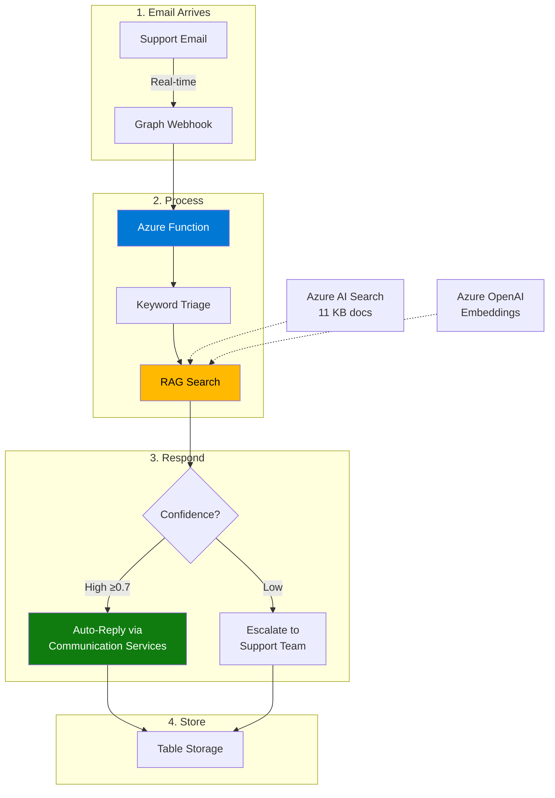

# Azure AI Foundry Smart Support Agent

Event-driven IT support system that automatically processes support emails using Azure AI Foundry, Azure Communication Services, and Graph API webhooks.

## Architecture



**System Flow:**
1. Microsoft Graph webhook receives email instantly
2. Keyword-based triage classifies category (Network/Access/Billing/Software) and priority
3. RAG search queries knowledge base and returns answer with confidence score
4. High confidence (≥0.7): Auto-reply via Azure Communication Services
5. Low confidence: Forward to support team
6. All tickets stored in Table Storage with unique IDs

**Key Technologies:**
- **Email:** Graph API (read) + Azure Communication Services (send)
- **AI:** Azure OpenAI (GPT-4o-mini, text-embedding-3-large)
- **Search:** Azure AI Search with semantic ranking
- **Storage:** Table Storage with EmailMessageId deduplication
- **Infrastructure:** Bicep templates, Azure Functions (Node.js + Python)

## Demos

This project includes 5 progressive demonstrations:

1. **Demo 01: AI Triage** - Keyword-based classification (Network/Access/Billing/Software)
2. **Demo 02: Simple RAG** - Basic retrieval-augmented generation with Azure AI Search
   - **Streaming Toggle**: Enable real-time token-by-token response streaming
3. **Demo 03: Agent with Tools** - Function calling patterns for extensibility
4. **Demo 06: Agentic Retrieval** - Query planning with parallel search fanout
5. **Demo 07: Multi-Agent Orchestration** - Specialized agents working together |

**Demo 05 - Copilot Studio Plugin**: Standalone REST API that exposes the triage classification as a Copilot Studio action. Includes OpenAPI spec, authentication setup, and agent configuration. [Setup Guide →](demos/05-triage-plugin/COPILOT-STUDIO-SETUP.md)

**Demo 06, 07 & 08 - Unified Fluent UI Interface**: Modern React app with real Microsoft Fluent UI components featuring Agentic Retrieval, Multi-Agent Orchestration, and Streaming RAG with real-time progressive answers. [Launch Guide →](demos/06-agentic-retrieval/README.md)

## Quick Start

**Single-command deployment (15 minutes):**

```powershell
.\scripts\deploy.ps1 -SubscriptionId "<your-sub-id>" -SupportEmail "support@yourdomain.com"
```
<details>
<summary><b>Manual step-by-step deployment (click to expand)</b></summary>

```powershell
```powershell
cd scripts
.\deploy.ps1 -SubscriptionId <your-sub-id> -SupportEmail "support@yourdomain.com"
   - Deploys all Azure infrastructure
   - Configures Communication Services
   - Ingests knowledge base
   - Deploys function code
   - Sets up Graph webhook
   - Verifies deployment
```

</details>

**Total time:** ~15 minutes from zero to working system.

## Prerequisites

- **Azure subscription** (Contributor or Owner access)
- **Microsoft 365 tenant** (any configuration)
- **Azure CLI** installed: `winget install Microsoft.AzureCLI`
- **PowerShell 7+**: `winget install Microsoft.PowerShell`
- **Node.js 20+**: `winget install OpenJS.NodeJS`

## Deployment

```powershell
.\scripts\deploy.ps1 -SubscriptionId "<your-sub-id>" -SupportEmail "support@yourdomain.com"
```

This script automatically:
1. Deploys Azure infrastructure (Bicep)
2. Links Communication Services domain
3. Ingests knowledge base (11 documents)
4. Deploys function code
5. Creates app registration & webhook
6. Verifies everything works

**Total time:** ~15 minutes hands-off

<details>
<summary><b>Manual deployment steps (click to expand)</b></summary>

### Step 1: Deploy Infrastructure

```powershell
az login
cd infra
az deployment sub create \
  --location westeurope \
  --template-file main.bicep \
  --parameters @parameters.dev.json
```

**What gets deployed:**
- Azure AI Foundry (AI Hub + Project)
- Azure OpenAI (gpt-4o-mini, text-embedding-3-large)
- Azure AI Search (Standard tier)
- Azure Functions (Node.js 20 + Python 3.11)
- Azure Communication Services (email sending)
- Table Storage (ticket persistence)
- Application Insights (monitoring)

**Cost:** ~$250-300/month (mostly AI Search Standard)

### Step 2: Post-Deployment

### Step 3: Send Test Email

```powershell
.\verify-deployment.ps1 -ResourceGroup rg-smart-agents-dev
```

Automatically:
- Creates app registration "SmartSupportAgent"
- Grants `Mail.Read` permission (admin consent)
- Creates client secret
- Configures function app settings
- **Auto-configures RAG_API_KEY** (prevents fallback responses)
- Configures Communication Services settings
- Creates webhook subscription (expires in 3 days)

### Step 4: Verify Deployment

```powershell
.\verify-deployment.ps1 -ResourceGroup rg-smart-agents-dev
```

Checks:
- Function apps deployed
- Communication Services domain linked
- RAG_API_KEY configured
- RAG endpoint returns 0.7+ confidence
- Knowledge base has documents
- Webhook subscription active

### Step 5: Test

Send email to your support address:

**Subject:** VPN Issues  
**Body:** My VPN keeps disconnecting every few minutes

**Expected:**
- ONE automated email response (no duplicates)
- Detailed VPN troubleshooting steps
- High confidence score (0.7-0.8)
- Ticket created in Table Storage

</details>

## Troubleshooting

| Issue | Solution |
|-------|----------|
| No email response | Run `.\post-deploy.ps1` to link domain and deploy code |
| RAG returns 0.3 confidence | RAG_API_KEY missing - re-run `.\setup-graph-webhook.ps1` |
| "DomainNotLinked" error | Re-run `.\deploy.ps1` or check Communication Services manually |
| Multiple duplicate emails | Deploy latest code with EmailMessageId deduplication |
| Webhook not processing | Check subscription: `GET /api/managesubscription` |
| Function logs show errors | Check Application Insights in Azure Portal |

## Configuration

All settings auto-configured by `setup-graph-webhook.ps1`:

| Variable | Purpose | Set By |
|----------|---------|--------|
| `GRAPH_CLIENT_ID` | App registration ID | setup-graph-webhook.ps1 |
| `GRAPH_CLIENT_SECRET` | App secret | setup-graph-webhook.ps1 |
| `GRAPH_TENANT_ID` | M365 tenant ID | setup-graph-webhook.ps1 |
| `SUPPORT_EMAIL_ADDRESS` | Email to monitor | setup-graph-webhook.ps1 |
| `RAG_ENDPOINT` | RAG function URL | setup-graph-webhook.ps1 |
| `RAG_API_KEY` | RAG auth key | setup-graph-webhook.ps1 ⭐ |
| `COMMUNICATION_SERVICES_CONNECTION_STRING` | Email sending | setup-graph-webhook.ps1 |
| `COMMUNICATION_SERVICES_SENDER_ADDRESS` | From address | setup-graph-webhook.ps1 |

## Maintenance

### Webhook Renewal (Every 3 Days)

```powershell
.\scripts\setup-graph-webhook.ps1 -ResourceGroup rg-smart-agents-dev -SupportEmail "support@domain.com"
```

### Update Knowledge Base

```powershell
# Add markdown files to demos/02-rag-search/content/
cd demos\02-rag-search\ingest
npm install
npm run dev
```

### View Logs

```powershell
# Application Insights in Azure Portal
# Or via CLI:
az monitor app-insights query \
  --app appi-smart-agents-<id> \
  --resource-group rg-smart-agents-dev \
  --analytics-query "traces | where timestamp > ago(1h) | order by timestamp desc | take 50"
```

## Project Structure

```
espc25/
├── demos/
│   ├── 01-triage-promptflow/           # Keyword classification (reference)
│   ├── 02-rag-search/                  # RAG endpoint (deployed)
│   ├── 03-agent-with-tools/            # Function calling (reference)
│   ├── 04-real-ticket-creation/        # Email system (deployed)
│   ├── 05-triage-plugin/               # Copilot Studio integration (deployed)
│   ├── 06-agentic-retrieval/           # Advanced RAG with Fluent UI (standalone)
│   └── 07-multi-agent-orchestration/   # Multi-agent system (via Demo 06 UI)
├── infra/
│   ├── main.bicep                      # Infrastructure definition
│   └── modules/                        # Resource modules
├── scripts/
│   ├── deploy.ps1                      # One-command deployment
│   ├── setup-graph-webhook.ps1         # Configure webhook
│   └── verify-deployment.ps1           # Check deployment
└── README.md
```

## Key Features

### Production Email System (Demos 01-05)
- **Event-Driven:** Real-time email processing via Graph webhooks
- **Duplicate Prevention:** EmailMessageId as unique Table Storage RowKey
- **Universal Compatibility:** Azure Communication Services works in all M365 tenants
- **High-Quality Answers:** RAG with 0.7-0.9 confidence from 11 KB documents
- **Auto-Triage:** Keyword-based classification (100% accuracy)
- **Production Ready:** Monitoring, error handling, automated deployment

### Advanced AI Patterns (Demos 06-07)
- **Agentic Retrieval:** Query decomposition → Parallel search → Citation-based merging
- **Multi-Agent Orchestration:** Triage → FAQ/RAG/Ticket routing with real Azure Table Storage tickets
- **Fluent UI Interface:** Real Microsoft Fluent UI React components with tab navigation
- **Progressive Enhancement:** Each demo showcases increasingly sophisticated AI patterns
- **Ticket Management:** Demo 07 creates tickets with `Status='Agent Created'` for non-email workflows


## Contributing

This is a demonstration project. To adapt for your use case:

1. **Customize Knowledge Base:** Replace `demos/02-rag-search/content/*.md` with your documentation
2. **Modify Triage Rules:** Update keyword matching in `demos/04-real-ticket-creation/function/src/services/AIService.ts`
3. **Add Custom Functions:** Create new tool endpoints in `demos/03-agent-with-tools/function-tool/src/`
4. **Adjust Confidence Threshold:** Modify auto-resolve threshold in `GraphWebhook.ts` (currently 0.7)
5. **Explore Advanced Patterns:** 
   - Demo 06: Enhance with custom query planning strategies
   - Demo 07: Add new agents or modify routing logic
   - Fluent UI: Customize React components and styling

## Running Advanced Demos

### Demo 06 & 07: Fluent UI Interface

```powershell
cd demos\06-agentic-retrieval
npm install
npm run ui:react
```

Open `http://localhost:5173` for:
- **Tab 1:** Agentic Retrieval (query decomposition + parallel search)
- **Tab 2:** Multi-Agent Orchestration (triage → routing → response)

Both use real Microsoft Fluent UI components with progressive result display.

## Additional Resources

- [Azure AI Foundry Documentation](https://learn.microsoft.com/azure/ai-studio/)
- [Azure OpenAI Service](https://learn.microsoft.com/azure/ai-services/openai/)
- [Azure AI Search](https://learn.microsoft.com/azure/search/)
- [Microsoft Graph Webhooks](https://learn.microsoft.com/graph/webhooks)
