# Azure AI Foundry Smart Support Agent

Autonomous IT support system demonstrating Azure AI Foundry capabilities through progressive demos: ticket classification, RAG search, agentic tool use, and event-driven email processing.

## What This Repository Contains

This project showcases **4 progressive demonstrations** of building intelligent support automation with Azure AI Foundry:

| Demo | What It Shows | Deployment Status | Key Technologies |
|------|---------------|-------------------|------------------|
| **[Demo 01: Triage](demos/01-triage-promptflow/)** | Classify support tickets by category and priority | **Reference** (logic used in Demo 04) | Azure OpenAI (GPT-4o-mini), Prompt engineering |
| **[Demo 02: RAG Search](demos/02-rag-search/)** | Answer questions using knowledge base retrieval | **Deployed** (Python Function) | Azure AI Search (vector + semantic), Embeddings |
| **[Demo 03: Agent Tools](demos/03-agent-with-tools/)** | Execute actions via function calling | **Reference** (pattern used in Demo 04) | Azure Functions, OpenAI function calling |
| **[Demo 04: Production System](demos/04-real-ticket-creation/)** | End-to-end event-driven email processing | **Deployed** (Node.js Function) | Microsoft Graph webhooks, Table Storage |

**Architecture Overview:**
```
Email arrives → Graph webhook → Triage (Demo 01 logic) → RAG search (Demo 02) → 
  Create ticket (Demo 03 pattern) → Auto-reply or escalate (Demo 04)
```

**How It Works:**

```mermaid
graph LR
    A[Email Arrives] --> B[Graph Webhook]
    B --> C{Triage<br/>Demo 01 Logic}
    C --> D[RAG Search<br/>Demo 02 Function]
    D --> E{Confidence<br/>Score}
    E -->|High ≥0.7| F[Auto-Reply<br/>to Customer]
    E -->|Low <0.7| G[Escalate to<br/>Support Team]
    F --> H[Create Ticket<br/>Demo 03 Pattern]
    G --> H
    
    style A fill:#0078d4,color:#fff
    style C fill:#ffb900,color:#000
    style D fill:#0078d4,color:#fff
    style E fill:#50e6ff,color:#000
    style F fill:#107c10,color:#fff
    style G fill:#d13438,color:#fff
```



**What Gets Deployed to Azure:**
- **func-agents-*** (Node.js 20): Email processing with keyword triage + ticket creation
- **func-rag-*** (Python 3.11): RAG search with confidence scoring

**What's Reference-Only:**
- **Demo 01:** Shows Prompt Flow structure (logic implemented as keyword matching in Demo 04)
- **Demo 03:** Shows function calling pattern (used for ticket creation in Demo 04)

Each demo builds on the previous, culminating in a production-ready system that auto-resolves 60-80% of support tickets.

## Prerequisites

### Required Tools
- **Azure CLI** (v2.50+): `winget install Microsoft.AzureCLI`
- **Azure subscription** with permissions to create resources
- **Node.js** (v20+): For Azure Functions development
- **Python** (v3.11+): For RAG function and test scripts
- **PowerShell** (v7+): For deployment and test scripts

### Azure Resources (Deployed via Bicep)
- **Azure AI Foundry** (AI Hub + AI Project)
- **Azure OpenAI** (gpt-4o-mini, text-embedding-3-large)
- **Azure AI Search** (Standard tier for semantic ranking)
- **Azure Functions** (Node.js 20 + Python 3.11)
- **Storage Account** (Table Storage for tickets)
- **Application Insights** (Monitoring and logging)
- **Key Vault** (Secrets management)

**Estimated Monthly Cost:** ~$250-300 (mostly AI Search Standard tier)

### Optional: Microsoft 365 Tenant
Required only for **Demo 04** (email processing):
- Microsoft 365 mailbox for monitoring (e.g., support@yourdomain.com)
- App registration with Graph API permissions (`Mail.Read`, `Mail.Send`)
- Admin consent for application permissions


## Getting Started

### Step 1: Deploy Azure Infrastructure

Deploy all required Azure resources to your subscription:

```powershell
# Login to Azure
az login
az account set --subscription <your-subscription-id>

# Deploy infrastructure (creates ~15 resources)
az deployment sub create `
  --location eastus `
  --template-file infra/main.bicep `
  --parameters @infra/parameters.dev.json

# Save deployment outputs for later use
az deployment sub show --name <deployment-name> --query properties.outputs
```

**What Gets Deployed:**
- Resource Group: `rg-smart-agents-dev` (Sweden Central)
- Azure AI Hub + AI Project
- Azure OpenAI with 2 model deployments (gpt-4o-mini, text-embedding-3-large)
- Azure AI Search (Standard tier)
- 2 Function Apps (Node.js 20 for email processing, Python 3.11 for RAG)
- Storage Account with Table Storage
- Application Insights + Log Analytics Workspace
- Key Vault with secrets

**Deployment Time:** ~10-15 minutes

### Step 2: Configure Environment Variables

**For Azure deployment**, the Bicep templates automatically configure all settings in the Function Apps.

**For local development** (optional), update `local.settings.json` files with your deployed resource values:

**Demo 02 RAG Function** (`demos/02-rag-search/rag-function/local.settings.json`):
```json
{
  "AZURE_AI_SEARCH_ENDPOINT": "https://srch-agents-<random>.search.windows.net",
  "AZURE_AI_SEARCH_API_KEY": "<get-from-portal>",
  "AZURE_OPENAI_ENDPOINT": "https://oai-agents-<random>.openai.azure.com/"
}
```

**Demo 04 Email Function** (`demos/04-real-ticket-creation/function/local.settings.json`):
```json
{
  "GRAPH_CLIENT_ID": "<app-registration-id>",
  "GRAPH_CLIENT_SECRET": "<app-registration-secret>",
  "GRAPH_TENANT_ID": "<tenant-id>",
  "SUPPORT_EMAIL_ADDRESS": "support@yourdomain.com",
  "STORAGE_ACCOUNT_NAME": "stagents<random>",
  "STORAGE_ACCOUNT_KEY": "<get-from-portal>"
}
```

**Get Values from Deployment:**
```powershell
# Get deployment outputs
az deployment sub show \
  --name smart-agents-deployment \
  --query properties.outputs -o json

# Get API keys
az search admin-key show --service-name srch-agents-<random> --resource-group rg-smart-agents-dev
az storage account keys list --name stagents<random> --resource-group rg-smart-agents-dev
```

> **Note:** Local settings are only needed for running functions locally with `func start`. Deployed functions get settings automatically from Bicep.

### Step 3: Ingest Knowledge Base (Demo 02)

Load support documentation into Azure AI Search:

```powershell
cd demos/02-rag-search
pip install -r requirements.txt
python ingest-kb.py
```

**What This Does:**
- Reads markdown files from `content/` directory
- Generates vector embeddings using text-embedding-3-large
- Uploads to Azure AI Search index with semantic ranking enabled

**Expected Output:** `Successfully indexed 3 documents to kb-support index`

### Step 4: Deploy Azure Functions

Deploy the **2 production functions** (Demos 01 & 03 are reference implementations only):

```powershell
# Deploy Demo 04: Email processing function (Node.js)
# Includes Demo 01 triage logic + Demo 03 function calling pattern
cd demos/04-real-ticket-creation/function
npm install
npm run build
func azure functionapp publish func-agents-<random>

# Deploy Demo 02: RAG search function (Python)
cd demos/02-rag-search/rag-function
func azure functionapp publish func-rag-<random>
```

**Verify Deployments:**
```powershell
# Test RAG function
Invoke-RestMethod -Uri "https://func-rag-<random>.azurewebsites.net/api/rag-search" `
  -Method Post `
  -Body '{"query":"How do I reset my password?"}' `
  -ContentType "application/json"

# Test email function health
Invoke-RestMethod -Uri "https://func-agents-<random>.azurewebsites.net/api/pingstorage"
```

### Step 5: Configure Microsoft Graph Webhook (Demo 04 Only)

**Automated Setup** (Recommended):

```powershell
# Run the setup script (requires Global Administrator privileges)
.\scripts\setup-graph-webhook.ps1 -SupportEmail "support@yourdomain.com"
```

**What the script does:**
- Creates app registration "SmartSupportAgent"
- Adds Microsoft Graph API permissions (Mail.Read, Mail.Send, User.Read.All)
- Grants admin consent
- Creates client secret
- Updates function app settings
- Creates webhook subscription

**Manual Alternative:**

<details>
<summary>Click to expand manual setup steps</summary>

1. **Create App Registration:**
   - Go to Azure Portal → Entra ID → App registrations → New registration
   - Name: `SmartSupportAgent`
   - Supported account types: Single tenant

2. **Add API Permissions:**
   - Microsoft Graph → Application permissions:
     - `Mail.Read`, `Mail.Send`, `User.Read.All`
   - Click **Grant admin consent**

3. **Create Client Secret:**
   - Certificates & secrets → New client secret

4. **Update Function App:**
   ```powershell
   az webapp config appsettings set `
     --name func-agents-<random> `
     --resource-group rg-smart-agents-dev `
     --settings `
       GRAPH_CLIENT_ID="<app-id>" `
       GRAPH_CLIENT_SECRET="<secret>" `
       GRAPH_TENANT_ID="<tenant-id>" `
       SUPPORT_EMAIL_ADDRESS="support@yourdomain.com"
   ```

5. **Create Webhook:**
   ```powershell
   $key = az functionapp keys list --name func-agents-<random> --resource-group rg-smart-agents-dev --query "functionKeys.default" -o tsv
   Invoke-RestMethod -Uri "https://func-agents-<random>.azurewebsites.net/api/managesubscription" -Method Post -Headers @{ "x-functions-key" = $key }
   ```
</details>

**⚠️ Important:** Webhook subscriptions expire after 3 days. Renew with the same script or see [docs/WEBHOOK-MANAGEMENT.md](docs/WEBHOOK-MANAGEMENT.md).

### Step 6: Test Each Demo

**Demo 01 - Triage:**
```powershell
cd tests
python test-demo01-triage.py
```
Expected: 100% category accuracy, 80%+ priority accuracy

**Demo 02 - RAG Search:**
```powershell
.\test-demo02-rag.ps1
```
Expected: Confidence scores 0.6-0.9 for relevant queries

**Demo 03 - Agent Tools:**
```powershell
cd demos/03-agent-with-tools/agent
npm install
npm run dev -- "Where is order 12345?"
```
Expected: Agent calls GetOrderStatus function and returns tracking info

**Demo 04 - Email Processing (if webhook configured):**
Send email to your configured support address with subject "VPN not connecting"
Expected: Auto-reply within 10 seconds with troubleshooting steps

## Demo Details

Each demo folder contains:
- **README.md** - Azure resources used and their purpose
- **Source code** - TypeScript/Python implementations
- **Requirements** - Dependencies and configuration

Navigate to individual demo READMEs for detailed resource explanations:
- [Demo 01: Ticket Triage](demos/01-triage-promptflow/README.md)
- [Demo 02: RAG Search](demos/02-rag-search/README.md)
- [Demo 03: Agent with Tools](demos/03-agent-with-tools/README.md)
- [Demo 04: Production Email System](demos/04-real-ticket-creation/function/README.md)

## Post-Deployment Configuration

Most setup is automated via Bicep, but a few steps need your input:

### Automated Setup (via scripts)

| Task | Script | What It Does |
|------|--------|--------------|
| **Graph API Setup** | `.\scripts\setup-graph-webhook.ps1` | Creates app registration, grants permissions, configures webhook |
| **Knowledge Base Ingestion** | `python demos/02-rag-search/ingest-kb.py` | Uploads support docs to AI Search |

### 🔧 Manual Configuration (if needed)

**For Demo 04 (Email Processing):**
- If the automated script fails, use [Step 5 manual instructions](#step-5-configure-microsoft-graph-webhook-demo-04-only)
- Renew webhook subscription every 3 days (limitation of Microsoft Graph API)

**For Custom Knowledge Base:**
- Add your markdown files to `demos/02-rag-search/content/`
- Re-run `ingest-kb.py` to update AI Search index

**For Local Development:**
- Create `local.settings.json` files (see [Step 2](#step-2-configure-environment-variables))
- Get API keys from Azure Portal if needed

### 📊 Optional Enhancements

- **Custom Email Domain:** Configure in Microsoft 365, update `SUPPORT_EMAIL_ADDRESS`
- **Monitoring Alerts:** Set up Application Insights alerts for errors/budget
- **Knowledge Base Expansion:** Add more documents to improve coverage

## Architecture Overview

**Real Production Flow:**

```mermaid
graph LR
    A[Email Arrives] --> B[Graph Webhook<br/>Triggers func-agents]
    
    B --> C[Demo 04 Function<br/>Node.js]
    
    C --> D[1. Keyword Triage<br/>Demo 01 logic]
    D --> E[2. HTTP Call to<br/>func-rag Python]
    
    E --> F{3. Confidence<br/>Score ≥0.7?}
    
    F -->|High| G[Auto-Reply<br/>to Customer]
    F -->|Low| H[Escalate to<br/>Support Team]
    
    G --> I[4. Create Ticket<br/>Demo 03 pattern<br/>Table Storage]
    H --> I
    
    style A fill:#0078d4,color:#fff
    style C fill:#ffb900,color:#000
    style E fill:#0078d4,color:#fff
    style F fill:#50e6ff,color:#000
    style G fill:#107c10,color:#fff
    style H fill:#d13438,color:#fff
```



**What Gets Deployed:**
- **func-agents-*** (Node.js): Receives webhook → triages → calls RAG → creates ticket → replies
- **func-rag-*** (Python): Receives HTTP request → searches knowledge base → returns answer + confidence

**How Demos Map to Production:**
- **Demo 01 logic** = Keyword matching inside func-agents
- **Demo 02** = Deployed as func-rag (called by func-agents via HTTP)
- **Demo 03 pattern** = Ticket creation code inside func-agents
- **Demo 04** = The func-agents function that orchestrates everything

## Project Structure

```
espc25/
├── demos/
│   ├── 01-triage-promptflow/      # Classification with prompts
│   ├── 02-rag-search/              # Knowledge base retrieval
│   ├── 03-agent-with-tools/        # Function calling
│   └── 04-real-ticket-creation/    # Production email system
├── infra/
│   ├── main.bicep                  # Infrastructure as Code
│   └── parameters.dev.json         # Environment config
├── tests/
│   ├── test-demo01-triage.py       # Triage validation
│   ├── test-demo02-rag.ps1         # RAG confidence tests
│   └── TEST-EMAIL-SCENARIOS.md     # Email test cases
└── docs/
    ├── WEBHOOK-MANAGEMENT.md       # Graph webhook guide
    └── DEPLOYMENT-ARCHITECTURE.md  # Detailed architecture
```


## Contributing

This is a demonstration project. To adapt for your use case:

1. **Customize Knowledge Base:** Replace `demos/02-rag-search/content/*.md` with your documentation
2. **Modify Triage Rules:** Update keyword matching in `demos/04-real-ticket-creation/function/src/services/AIService.ts`
3. **Add Custom Functions:** Create new tool endpoints in `demos/03-agent-with-tools/function-tool/src/`
4. **Adjust Confidence Threshold:** Modify auto-resolve threshold in `GraphWebhook.ts` (currently 0.7)

## Additional Resources

- [Azure AI Foundry Documentation](https://learn.microsoft.com/azure/ai-studio/)
- [Azure OpenAI Service](https://learn.microsoft.com/azure/ai-services/openai/)
- [Azure AI Search](https://learn.microsoft.com/azure/search/)
- [Microsoft Graph Webhooks](https://learn.microsoft.com/graph/webhooks)
