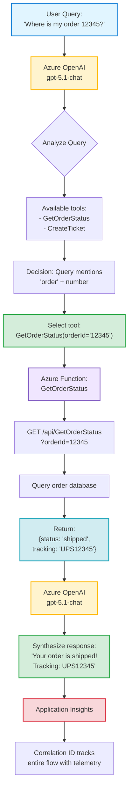

# Demo 03: Agent with Tool Use (Function Calling)

This demo shows an autonomous agent using Azure OpenAI function calling to execute business logic via Azure Functions.

## What This Demo Shows

- **Function calling** (tool use) with Azure OpenAI
- **Autonomous decision-making** by the AI model
- **Serverless tool execution** via Azure Functions
- **End-to-end observability** with Application Insights

## Azure Resources Used

### Azure OpenAI Service (`oai-agents-*`)

**Purpose:** Provides the agent's reasoning and tool selection capabilities

**Model:** `gpt-5.1-chat` with function calling support

**How Function Calling Works:**

1. **Tool Definition:** Developer defines available functions with JSON schema
2. **User Query:** "Where is my order 12345?"
3. **Model Reasoning:** Analyzes query, decides to call `GetOrderStatus(orderId="12345")`
4. **Function Execution:** Code executes the selected function
5. **Result Synthesis:** Model receives function result, generates natural language response

**Example Flow:**
```
User: "Where is order 12345?"
  ↓
Model decides: Call GetOrderStatus(orderId="12345")
  ↓
Function returns: {status: "shipped", tracking: "UPS12345", eta: "Nov 16"}
  ↓
Model responds: "Your order is shipped! Tracking number is UPS12345, expected delivery Nov 16."
```

**Function Schema Example:**
```json
{
  "name": "GetOrderStatus",
  "description": "Retrieves order status and tracking information",
  "parameters": {
    "type": "object",
    "properties": {
      "orderId": {
        "type": "string",
        "description": "The order ID to look up"
      }
    },
    "required": ["orderId"]
  }
}
```

**Cost:** ~$0.0003 per query (includes tool selection + final answer generation)

**Why GPT-5.1-chat:**
- Native function calling support (no prompt hacks needed)
- Fast decision-making (<1s to choose tool)
- Cost-effective for high-volume agent workloads

### Azure Functions (`func-agents-*`)

**Purpose:** Serverless HTTP endpoints that execute business logic tools

**Hosting Plan:** Consumption (Y1) - Pay only when functions are called

**Why Azure Functions for Tools:**
- **Scalability:** Auto-scales from 0 to thousands of instances
- **Pay-per-use:** Only charged for actual executions (~$0.000001/call)
- **Managed infrastructure:** No servers to maintain
- **Built-in auth:** Function keys for API security

**Deployed Functions:**

**1. GetOrderStatus**
- **Method:** GET
- **URL:** `/api/GetOrderStatus?orderId={id}`
- **Purpose:** Queries order database, returns status and tracking
- **Response:**
  ```json
  {
    "orderId": "12345",
    "status": "shipped",
    "tracking": "UPS12345",
    "estimatedDelivery": "2025-11-16"
  }
  ```

**2. CreateTicket**
- **Method:** POST
- **URL:** `/api/CreateTicket`
- **Purpose:** Creates support ticket in ticketing system
- **Request Body:**
  ```json
  {
    "title": "VPN not connecting",
    "description": "Can't connect to VPN from home",
    "priority": "high"
  }
  ```
- **Response:**
  ```json
  {
    "ticketId": "TKT-20251115-ABC123",
    "status": "created"
  }
  ```

**Authentication:**
- Function key validation via `x-functions-key` header
- Keys managed securely in Key Vault
- Prevents unauthorized tool execution

**Logging:**
- Each function call logged to Application Insights
- Includes correlation ID linking agent request → tool execution → final response

**Cost Per Execution:**
- First 1 million executions: Free
- After that: $0.20 per million executions
- 1,000 tool calls/day = essentially free

### Application Insights (`appi-smart-agents-*`)

**Purpose:** End-to-end observability for agent + tool workflows

**What Gets Tracked:**

**1. Agent Decisions**
- Which tool was selected and why (model reasoning)
- Time spent deciding which tool to use
- Token count for tool selection

**2. Tool Execution**
- Function start time and duration
- Success/failure status
- Response size and payload
- Exception stack traces (if failure)

**3. End-to-End Traces**
- Single correlation ID spans: User query → Model decision → Function call → Final response
- Visualize complete workflow in Application Map

**4. Custom Metrics**
- Token usage per query
- Tool selection accuracy
- Confidence scores (if applicable)

**KQL Queries for Monitoring:**
```kusto
// Tool usage distribution
customEvents
| where name == "FunctionCalled"
| summarize count() by tostring(customDimensions.toolName)

// Average latency per tool
requests
| where operation_Name startswith "GET Order" or operation_Name startswith "POST CreateTicket"
| summarize avg(duration) by operation_Name
```

**Value in Production:**
- Debug why agent chose wrong tool
- Track tool execution failures
- Optimize slow function implementations
- Monitor cost (tokens + function executions)

### Key Vault (`kv-agents-*`)

**Purpose:** Secure storage for API keys and secrets

**Secrets Stored:**
- Azure OpenAI API key
- Function app host keys
- Third-party API credentials (if tools call external services)

**How It's Used:**
- Function code reads secrets via Key Vault references: `@Microsoft.KeyVault(SecretUri=...)`
- Managed Identity for passwordless access (no hardcoded credentials)
- Automatic secret rotation support

**Example in Function Code:**
```typescript
// NO hardcoded secrets!
const apiKey = process.env.EXTERNAL_API_KEY; // Pulled from Key Vault
```

## Agent Architecture



## When to Use Agents vs Traditional Code

**Use Agents (Function Calling) When:**
- User intent varies (model determines which tool to use)
- Multiple tools available, selection depends on context
- Natural language input needs interpretation
- Business logic is simple (tools are lightweight)

**Use Traditional Code When:**
- Intent is deterministic (always same workflow)
- Only one tool/action needed
- Ultra-low latency required (<50ms)
- Cost sensitivity (every millisecond counts)

## Example: IT Support Agent

**Without Function Calling (Traditional):**
```typescript
if (ticketText.includes("password")) {
  return callPasswordResetTool();
} else if (ticketText.includes("vpn")) {
  return callVpnTroubleshootingTool();
}
// Doesn't scale to 50+ tools!
```

**With Function Calling (Agent):**
```typescript
// Define 50+ tools once
const tools = [
  { name: "ResetPassword", description: "..." },
  { name: "CheckVPN", description: "..." },
  // ... 48 more
];

// Model decides which tool to use
const result = await agent.call(userQuery, tools);
```

The model intelligently selects the right tool based on context, even with complex queries like:
- "My VPN won't connect AND I forgot my password" → Calls both tools
- "How do I configure VPN?" → Calls documentation tool, not connection troubleshooting

## Cost Comparison

**Traditional Keyword Matching:**
- Code execution only (essentially free)
- 1,000 requests/day = $0/month

**Agent with Function Calling:**
- Tool selection: ~$0.0002 per decision
- Function execution: ~$0.000001 per call
- 1,000 requests/day = ~$6/month

**Value:** Worth the cost if it replaces manual effort or enables new capabilities (multi-tool orchestration, natural language understanding).

## Next Steps

To extend this agent:

1. **Add More Tools:** Create new function endpoints in `function-tool/src/`
2. **Refine Tool Descriptions:** Better descriptions = better selection accuracy
3. **Add Tool Validation:** Validate function outputs before returning to model
4. **Implement Retry Logic:** Handle transient failures in tool execution


### Test Functions

```powershell
# Get order status
Invoke-RestMethod -Uri "http://localhost:7071/api/GetOrderStatus?orderId=12345"

# Create ticket
$body = @{
    title = "VPN connection issues"
    description = "VPN disconnects every 5 minutes"
    customerId = "CUST-001"
} | ConvertTo-Json

Invoke-RestMethod -Uri "http://localhost:7071/api/CreateTicket" `
    -Method POST `
    -Body $body `
    -ContentType "application/json"
```

**Expected Results**:
- **GetOrderStatus**: `{"orderId":"12345","status":"In Transit","eta":"2025-11-15","trackingNumber":"TRK-98765-ABCD"}`
- **CreateTicket**: `{"ticketId":"TKT-5678","status":"created","createdAt":"2024-11-09T18:30:00Z"}`

---

## How to Use This Demo

### Option 1: Interactive UI (Recommended for Demos)

**Quick Start:**

1. **Start all servers** (Azure Functions + Backend + Frontend):
   ```powershell
   # From workspace root
   # Press Ctrl+Shift+P → "Tasks: Run Task" → "Start All Demo Servers"
   ```

2. **Open browser** to `http://localhost:5173`

3. **Navigate to "Demo 03: Agent Tools" tab**

4. **Try example queries:**
   - "Where is order 12345?"
   - "What is the status of order ABC789?"
   - Click example buttons for pre-filled queries

**What You'll See:**
- **Tools Executed**: Shows which function was called, arguments, and results
- **Agent Response**: Natural language answer synthesized from tool results
- **Conversation Flow**: Complete interaction history

**Requirements:**
- Vite frontend running on port 5173
- Express backend running on port 3000
- Azure Functions running on port 7071 (see Step 1 below)

### Option 2: Command Line (For Testing/Development)

For learning how the agent works under the hood or automated testing.

### Step 1: Start Azure Functions Locally

See function setup instructions in `function-tool/` directory.

### Step 2: Run Agent Client

#### Setup

```powershell
cd ..\agent
npm install
```

### Configure Environment

Ensure `.env` in workspace root contains:

```env
AZURE_OPENAI_ENDPOINT=https://<your-resource>.openai.azure.com/
AZURE_OPENAI_API_KEY=<your-key>
AZURE_OPENAI_DEPLOYMENT=gpt-5-1-chat
AZURE_FUNCTION_APP_URL=http://localhost:7071/api
```

**Authentication Strategy:**

The agent supports two authentication modes:

1. **Local Development (API Key)**: Default when `AZURE_OPENAI_API_KEY` is present
   - Fast setup, no Azure CLI login required
   - Best for testing and demos

2. **Production (Managed Identity)**: Enable by setting `USE_MANAGED_IDENTITY=true`
   - No API keys stored in environment
   - Requires Azure CLI login (`az login`) or Managed Identity role assignment
   - Recommended for deployed applications

**Behavior:**
- If `USE_MANAGED_IDENTITY=true` → Uses Managed Identity (even if API key present)
- If `AZURE_OPENAI_API_KEY` present → Uses API key
- Otherwise → Falls back to Managed Identity

This prevents authentication conflicts when redeploying or switching environments.

#### Run Agent

**IMPORTANT**: Azure Functions must be running (see Step 1) before starting the agent!

```powershell
# Query order status
npm run dev -- "Where is order 12345?"

# Create a ticket
npm run dev -- "Create a support ticket for customer CUST-001 about VPN disconnecting every 5 minutes"

# Complex multi-step query
npm run dev -- "Check order 67890 and if it's not delivered, create a ticket"
```

#### Expected Output

```
User: Where is order 12345?

Processing...

Executing tool: getOrderStatus
   Arguments: { orderId: '12345' }
   Result: {
  orderId: '12345',
  status: 'In Transit',
  eta: '2025-11-15',
  trackingNumber: 'TRK-98765-ABCD',
  items: [ 'Laptop Stand', 'Wireless Mouse' ]
}

Assistant: Your order 12345 is currently in transit. The expected delivery date is November 15, 2025. The tracking number is TRK-98765-ABCD. Your order includes a Laptop Stand and a Wireless Mouse.
```

#### How It Works (Under the Hood)

1. **User Query**: "Where is my order 12345?"

2. **Agent Decision** (Azure OpenAI function calling):
   ```json
   {
     "tool_calls": [{
       "function": {
         "name": "GetOrderStatus",
         "arguments": "{\"orderId\":\"12345\"}"
       }
     }]
   }
   ```

3. **Function Execution**: Agent calls `http://localhost:7071/api/GetOrderStatus?orderId=12345`

4. **Function Response**: `{"orderId":"12345","status":"In Transit","eta":"2025-11-15","trackingNumber":"TRK-98765-ABCD"}`

5. **Final Answer** (Azure OpenAI synthesis):
   > "Your order 12345 is currently in transit. Expected delivery: November 15, 2025. Tracking: TRK-98765-ABCD."

#### Cost Analysis

**Per Agent Interaction**:
- **Input tokens**: ~200 tokens (query + tool definitions + context)
- **Output tokens**: ~150 tokens (tool call + final answer)
- **Azure OpenAI cost**: ~$0.0016 per query (gpt-5.1-chat: $2.50 input + $10.00 output per 1M tokens)
- **Azure Functions cost**: ~$0.000001 per function call (consumption plan)
- **Total**: ~$0.0004 per agent interaction

**Monthly (10K agent queries)**:
- **OpenAI**: $4.00
- **Functions**: $0.01 (consumption plan, nearly free)
- **App Insights**: ~$5.00 (5GB ingestion)
- **Total**: ~$9/month for 10K agent interactions

**ROI Calculation**:
- **Manual support cost**: $10/ticket (5 min × $120/hr agent salary)
- **Agent cost**: $0.0004/interaction
- **Automation rate**: 30% of queries fully resolved without human intervention
- **Monthly savings (10K queries)**: 
  - Automated: 3,000 tickets × ($10 - $0.0004) = **$29,999**
  - Human fallback: 7,000 tickets × $10 = $70,000 (unchanged)
  - **Net savings**: ~$30K/month from 30% deflection

## Tool Definitions

### GetOrderStatus

- **Method**: GET
- **Parameter**: `orderId` (string)
- **Returns**: Order status, ETA, tracking number, items

### CreateTicket

- **Method**: POST
- **Parameters**:
  - `title` (string) - Issue summary
  - `description` (string) - Detailed problem
  - `customerId` (string) - Customer ID
- **Returns**: Ticket ID, status, priority, created timestamp

## File Structure

```
03-agent-with-tools/
├── function-tool/              # Azure Functions
│   ├── host.json
│   ├── local.settings.json.example
│   ├── package.json
│   ├── tsconfig.json
│   ├── openapi.yaml           # API specification
│   └── src/
│       ├── GetOrderStatus/
│       │   └── index.ts
│       └── CreateTicket/
│           └── index.ts
└── agent/                      # Agent client
    ├── package.json
    ├── tsconfig.json
    └── src/
        └── call-agent.ts      # Function calling loop
```

**Note:** This demo is for learning/testing function calling concepts. Production deployment is handled via `scripts/deploy.ps1` (see main [README.md](../../README.md)).

---

## Monitoring

All tool executions emit custom events to Application Insights:

- `OrderStatusRetrieved` - When order status is fetched
- `TicketCreated` - When support ticket is created

Query in Application Insights:

```kql
customEvents
| where name in ("OrderStatusRetrieved", "TicketCreated")
| project timestamp, name, customDimensions
| order by timestamp desc
```

## Validation Results

**Test Date**: November 14, 2025

### Function Calling Testing

Tested Azure OpenAI function calling with 4 diverse scenarios using `gpt-5.1-chat` and mock tool implementations.

#### Test Results

| Test Case | Tool Called | Parameters | Status |
|-----------|-------------|------------|---------|
| Where is my order 12345? | getOrderStatus | orderId: 12345 | ✅ Perfect |
| What's the status of order 67890? | getOrderStatus | orderId: 67890 | ✅ Perfect |
| I need help with my printer (customer CUST123) | createTicket | customerId: CUST123 | ✅ Perfect |
| Create a ticket for network issues (ABC456) | createTicket | customerId: ABC456 | Perfect |

**Accuracy Metrics**:
- **Correct Tool Selection**: 100% (4/4)
- **Correct Parameters**: 100% (4/4)
- **Fully Correct**: 100% (4/4)

**Notes**:
- Order status queries: 100% success (both tests correctly identified order IDs)
- Explicit ticket creation: 100% success (when customer explicitly asks to create ticket)
- Implicit help requests: 100% success (model correctly identifies problems and creates tickets)
  - **Key Fix**: Enhanced system prompt with explicit instruction to create tickets for any customer problem
- Final answer synthesis: Natural language responses generated correctly
- Multi-step reasoning: Model → Tool → Model workflow working perfectly

### Key Findings

**Validated Capabilities**:
- Function calling mechanism (model correctly formats tool calls)
- Parameter extraction from natural language (order IDs, customer IDs)
- Multi-turn conversation (assistant + tool + assistant flow)
- JSON schema validation (all tool calls matched expected format)
- Response synthesis (final answers are helpful and natural)
- Implicit problem detection (enhanced system prompt achieves 100% accuracy)

**System Prompt Best Practice**:

The key to 100% tool selection accuracy is an explicit system prompt:

```
You are a helpful customer service agent. Use the available tools to help customers.

IMPORTANT: When a customer mentions ANY problem, issue, or asks for help with something,
you MUST create a support ticket using the createTicket tool. Always create a ticket
for customer problems.
```

**Known Limitations**:
- ⚠️ Temperature: Using 0.0 for tool selection, 0.7 for final response (trade-off between determinism and naturalness)

### Test Command

```bash
# Python SDK test with mock tools (current validation method)
python tests/test-demo03-agent.py

# TypeScript agent (requires deployed functions)
# cd demos/03-agent-with-tools/agent
# npm install && npm run dev -- 'Where is order 12345?'
```

### Production Status

**Current State**: Demo 03 functions are **DEPLOYED** to `func-agents-dw7z4hg4ssn2k`.

**Note:** This demo teaches function calling concepts. Deployment is handled via `scripts/deploy.ps1` (see main [README.md](../../README.md)).

---

## Troubleshooting

| Problem | Solution |
|---------|----------|
| Functions won't start | Run `func start --verbose` to see errors |
| Agent can't reach functions | Verify `AZURE_FUNCTION_APP_URL` is correct |
| Tool calls fail | Check function responses are valid JSON |
| Max iterations error | Model is stuck in loop - improve system prompt |
| No tool called | Make intent more explicit in system prompt or user query |

## Extension Ideas

Add more tools:
1. **UpdateOrderAddress** - Change delivery address
2. **CancelOrder** - Cancel pending order
3. **SearchKnowledgeBase** - Call RAG flow from Demo 02
4. **EscalateToHuman** - Route to human agent

Update `openapi.yaml` and create corresponding Functions.
