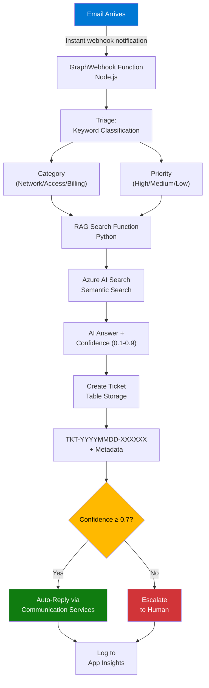

# Demo 04: Production Email Support System

This demo integrates all previous demos into a complete, event-driven email processing system that automatically creates support tickets and responds to customers.

## What This Demo Shows

- **Event-driven architecture** with Microsoft Graph webhooks
- **Complete AI pipeline:** Triage (Demo 01) → RAG (Demo 02) → Tool calling pattern (Demo 03)
- **Persistent storage** for ticket tracking
- **Intelligent routing:** Auto-reply vs escalation based on confidence
- **Production-ready patterns:** Deduplication, error handling, observability

## System Architecture



## Production Components

### 1. GraphWebhook Function
- **Trigger**: HTTP POST from Microsoft Graph
- **Auth Level**: Anonymous (required for Graph validation)

## Azure Resources Used

### Azure Functions - Email Processing (`func-agents-*`)

**Purpose:** Serverless compute for email orchestration and business logic

**Runtime:** Node.js 20 (TypeScript compiled to JavaScript)

**Hosting Plan:** Consumption (Y1) - auto-scales, pay-per-execution

**Deployed Functions:**

**1. GraphWebhook** (MAIN - Event-Driven Entry Point)
- **Trigger:** HTTP POST from Microsoft Graph
- **Auth:** Anonymous (required for Graph validation - Microsoft posts to this endpoint)
- **Purpose:** Real-time email processing when new message arrives
- **Logic:**
  1. Validates webhook request (clientState security token)
  2. Checks if email is from support address (prevents infinite loop if we reply to ourselves)
  3. Queries Table Storage to check for duplicate EmailMessageId
  4. If new: processes email through triage \u2192 RAG \u2192 ticket creation pipeline
- **Response Time:** <10 seconds end-to-end
- **Cost:** \ (within free tier for typical volume)

**2. ManageSubscription** (Webhook Management)
- **Trigger:** HTTP GET/POST/DELETE
- **Auth:** Function key required (manual management endpoint)
- **Purpose:** Create, renew, and list Microsoft Graph webhook subscriptions
- **Operations:**
  - GET: List active subscriptions
  - POST: Create new subscription (expires in 3 days)
  - DELETE: Remove subscription
- **Why Needed:** Microsoft Graph webhooks expire after 3 days, must be renewed
- **Note:** Set up automated renewal or manual renewal every 3 days

**3. ProcessSupportEmail** (Manual Processing)
- **Trigger:** HTTP GET/POST
- **Auth:** Function key required
- **Purpose:** Batch process all unread emails (bypasses webhook)
- **Use Cases:**
  - Webhook subscription expired
  - Backlog of emails to process
  - Testing triage/RAG changes on historical data
- **When to Use:** Not needed if webhook is active; useful for troubleshooting

**4. PingStorage** (Health Check)
- **Trigger:** HTTP GET
- **Auth:** Anonymous
- **Purpose:** Verifies connectivity to Table Storage
- **Returns:** Test ticket ID if storage is working
- **Use Case:** Quick health check for monitoring/alerts

### Azure Table Storage (\stagents*\)

**Purpose:** Persistent NoSQL storage for support tickets

**Why Table Storage (vs Cosmos DB or SQL):**
- **Cost:** Very cheap (\.045 per GB/month vs \+ for SQL)
- **Scalability:** Handles millions of tickets effortlessly
- **Simple Schema:** Key-value access pattern, no complex queries needed
- **Performance:** <10ms read/write latency

**Schema: SupportTickets Table**

**Partition Key:** \TICKET\ (all tickets in same partition - acceptable for demo, optimize for production)

**Row Key:** \TKT-YYYYMMDD-XXXXXX\ (e.g., \TKT-20251115-A3B7F2\)
- Format ensures chronological sorting
- 6-character random suffix prevents collisions

**Fields:**
| Field | Type | Purpose | Example |
|-------|------|---------|---------|
| TicketID | string | Display ID (same as Row Key) | TKT-20251115-A3B7F2 |
| Title | string | Email subject | "VPN not connecting" |
| Description | string | Email body content | "Can't connect to VPN from home..." |
| CustomerEmail | string | Sender's email address | customer@example.com |
| Category | string | Triage category | Network, Access, Billing, Software, Other |
|\Priority | string | Triage priority | High, Medium, Low |
|\Status | string | Processing status | New, AI Resolved, Needs Human Review |
| AIResponse | string | Generated answer from RAG | "To fix VPN issues: 1. Check firewall..." |
| Confidence | number | RAG confidence score | 0.85 (range: 0.1-0.9) |
| EmailMessageId | string | Graph message ID (for deduplication) | AAMkAGZjOT... |
| Timestamp| datetime | Ticket creation time | 2025-11-15T13:45:00Z |

**Deduplication Logic:**
Before creating ticket, query Table Storage:
\\\	ypescript
const duplicate = await tableClient.getEntity("TICKET", emailMessageId);
if (duplicate) return; // Skip processing
\\\

### Microsoft Graph API (M365 Integration)

**Purpose:** Read incoming support emails via webhook notifications

**Authentication:** App Registration with Application Permissions

**Required Permissions (admin consent required):**
- `Mail.Read` - Read all mailboxes
- `User.Read.All` - Read user profiles

**Note:** Email sending is handled by Azure Communication Services (see below), not Graph API

**Webhook Subscription:**
- **Resource:** \/users/{email}/mailFolders/Inbox/messages\
- **Change Type:** \created\ (trigger on new email only)
- **Notification URL:** GraphWebhook function endpoint
- **Expiration:** 3 days (4320 minutes) - Microsoft Graph limitation
- **Client State:** Random secret token for validation

**How Webhook Works:**
1. User emails your support address
2. Microsoft Graph detects new email in monitored mailbox
3. Graph POSTs notification to GraphWebhook function: \{"\u0040odata.type":"#Microsoft.Graph.ChangeNotification","resource":"..."}\
4. Function validates clientState, fetches email details, processes

### Azure Communication Services (`commserv-agents-*`)

**Purpose:** Send auto-reply emails to customers

**Why Communication Services (vs Graph API `Mail.Send`):**
- **Tenant Compatibility:** Works across all M365 tenants without special permissions
- **No Admin Consent:** Doesn't require `Mail.Send` application permission
- **Reliable Delivery:** Purpose-built for transactional email
- **Cost Effective:** Pay-per-email pricing (~$0.0001 per email)

**Domain Configuration:**
- Uses **AzureManagedDomain** (automatic domain provided by Azure)
- Domain must be **linked** to Communication Services resource (done via `deploy.ps1`)
- Sender address: `DoNotReply@<your-azurecomm-domain>.azurecomm.net`

**How It's Used:**
```typescript
// EmailService.ts
const emailClient = new EmailClient(connectionString);
const message = {
  senderAddress: "DoNotReply@azurecomm.net",
  recipients: { to: [{ address: customerEmail }] },
  content: {
    subject: `Re: ${ticketTitle}`,
    plainText: aiResponse
  }
};
await emailClient.beginSend(message);
```

**Configuration Required:**
- `COMMUNICATION_SERVICES_CONNECTION_STRING` - Connection string from Azure Portal
- Domain linking via Azure CLI (automated in deployment scripts)

### Python RAG Function (`func-rag-*`)

**Purpose:** Semantic search and answer generation

**Runtime:** Python 3.11

**Hosting Plan:** Consumption (Y1)

**How It's Called:**
\\\	ypescript
const response = await fetch(process.env.RAG_ENDPOINT, {
  method: 'POST',
  headers: { 'x-functions-key': process.env.RAG_API_KEY },
  body: JSON.stringify({ query: emailBody })
});
\\\

**What It Does:**
1. Receives user question
2. Generates embedding via Azure OpenAI (text-embedding-3-large)
3. Hybrid search in Azure AI Search (vector + keyword + semantic)
4. Scores results using semantic reranker (0-4)
5. Maps score to confidence (0.1-0.9)
6. Generates answer via GPT-5.1-chat with top retrieved passages as context
7. Returns: `{answer: "...", confidence: 0.85, sources: [...]}`

**Confidence Thresholds:**
- ≥0.7: Auto-reply to customer (high confidence)
- <0.7: Escalate to human review (low confidence or ambiguous)

See [Demo 02 README](../../02-rag-search/README.md) for detailed RAG architecture.

### Application Insights (`appi-smart-agents-*`)

**Purpose:** End-to-end observability and monitoring

**What Gets Logged:**

**1. Request Traces**
- Every function execution with duration
- HTTP status codes and response sizes
- Correlation IDs linking email \u2192 triage \u2192 RAG \u2192 ticke
**2. Custom Events**- EmailProcessed\: New email received
- TicketCreated\: Ticket stored in Table Storage
- AutoReply: High-confidence auto-reply sent- Escalated: Low-confidence escalation to human

**3. Dependencies**
- Graph API calls (read email, send reply)
- Table Storage queries (deduplication, ticket creation)
- RAG function HTTP calls

**4. Exceptions**
- Stack traces for errors
- Failed RAG calls
- Graph API auth failures

**KQL Query Examples:**

```kusto
// Average confidence by category
customEvents
| where name == "TicketCreated"
| extend confidence = todouble(customDimensions.confidence)
| summarize avg(confidence) by tostring(customDimensions.category)

// Processing time breakdown
requests
| where operation_Name == "GraphWebhook"
| summarize avg(duration), max(duration), percentile(duration, 95)
```

## Configuration Requirements

All environment variables are configured in Function App Settings (see main [README.md](../../../README.md) for deployment):

**Required:**
- `GRAPH_CLIENT_ID`, `GRAPH_CLIENT_SECRET`, `GRAPH_TENANT_ID` - App registration credentials (reading emails)
- `COMMUNICATION_SERVICES_CONNECTION_STRING` - Azure Communication Services (sending emails)
- `SUPPORT_EMAIL` - Monitored mailbox address
- `STORAGE_ACCOUNT_NAME`, `STORAGE_ACCOUNT_KEY` - Table Storage connection
- `RAG_ENDPOINT`, `RAG_API_KEY` - RAG function endpoint

**Optional:**
- `APPINSIGHTS_CONNECTION_STRING` - Monitoring (auto-configured via Bicep)

## Next Steps

For deployment and testing instructions, see:
- **Main README:** [../../../README.md](../../../README.md)
- **Webhook Management:** [../../../docs/WEBHOOK-MANAGEMENT.md](../../../docs/WEBHOOK-MANAGEMENT.md)
- **Test Scenarios:** [../../../tests/TEST-EMAIL-SCENARIOS.md](../../../tests/TEST-EMAIL-SCENARIOS.md)
