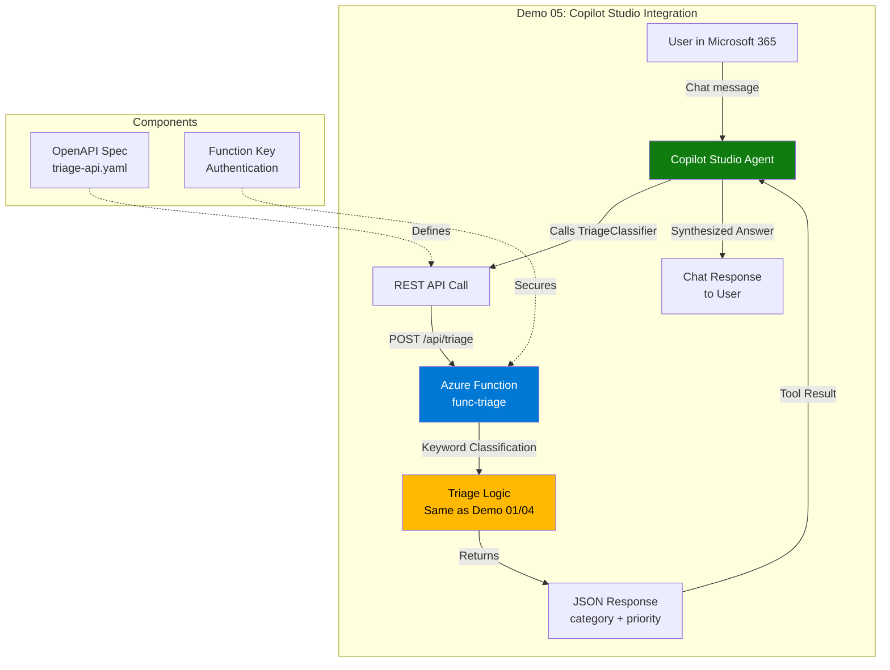
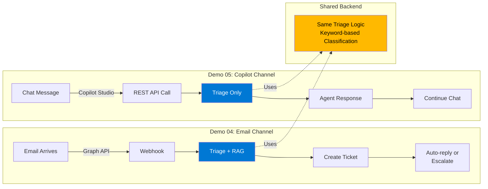

# Demo 05 - Smart Support Assistant for Copilot Studio

> REST API with triage classification AND RAG-powered answers from knowledge base, integrated with Copilot Studio.

## 🏗️ Deployment Architecture

**Important:** Demo 05 endpoints are deployed as part of the main Agents function app (`func-agents`), not as a separate function app.

- **Function App:** `func-agents-<uniqueid>` (same as Demo 04)
- **Endpoints Included:**
  - `/api/triage` - Ticket classification
  - `/api/answer` - RAG-powered KB search
  - (Plus all Demo 04 endpoints: GraphWebhook, ProcessSupportEmail, etc.)

**Why?** Simpler deployment, shared authentication, reduced resource costs. The `deploy.ps1` script automatically includes Demo 05 when deploying Demo 04.

## 📚 Quick Links

- **[Copilot Studio Setup Guide](./COPILOT-STUDIO-SETUP.md)** - Complete setup guide with agent configuration, instructions, and troubleshooting

## Overview

This demo provides two REST API endpoints for Copilot Studio integration:

### 1. Answer Endpoint (`/api/answer`) - NEW in v2.0
- Searches knowledge base using RAG (Retrieval-Augmented Generation)
- Returns AI-generated answer with confidence score (0.1-0.95)
- Same RAG engine as Demo 04 email automation
- Enables confidence-based routing (≥0.7 = high confidence)

### 2. Triage Endpoint (`/api/triage`)
- Classifies tickets into categories (Network/Access/Billing/Software/Other)
- Assigns priority levels (High/Medium/Low)
- Uses proven keyword-based logic from Demo 04
- Useful for analytics and ticket routing

**Key Improvement:** Bot now provides actual solutions, not just classification!

## Architecture

### Integration Flow



### Comparison with Demo 04



| Aspect | Demo 04 (Email) | Demo 05 (Copilot) |
|--------|----------------|-------------------|
| **Trigger** | Email arrives | User chat message |
| **Input** | Email body | Chat text |
| **Classification** | Keyword-based | Same (API call) |
| **Knowledge Base** | RAG function | Copilot knowledge sources |
| **Action** | Create ticket, auto-reply | Chat response |
| **User Experience** | Asynchronous (email) | Synchronous (chat) |

## Categories

- **Access** - Login, password, authentication issues
- **Network** - VPN, connection, connectivity problems
- **Billing** - Invoices, charges, payments
- **Software** - Applications, programs, installations
- **Other** - Everything else

## Priority Levels

- **High** - Urgent, critical, emergency, system down
- **Medium** - Default priority
- **Low** - Low priority, when you can, no rush

## Quick Start

### Prerequisites

Before deploying, ensure Demo 02 RAG function is deployed (required for `/api/answer` endpoint):

```powershell
# Verify RAG function exists
az functionapp list --resource-group rg-smart-agents-dev --query "[?contains(name, 'func-rag')].name" -o tsv
```

If not deployed, follow Demo 02 deployment first.

### 1. Create Function App

```powershell
# Get unique suffix from existing infrastructure
$suffix = "7egpzzovabxku"  # Use your suffix from rg-smart-agents-dev

# Create dedicated function app for triage
az functionapp create \
  --name "func-triage-$suffix" \
  --resource-group rg-smart-agents-dev \
  --storage-account "stagents$suffix" \
  --runtime node \
  --runtime-version 20 \
  --functions-version 4 \
  --consumption-plan-location swedencentral \
  --os-type Linux

# Enable worker indexing for Functions v4 programming model
az functionapp config appsettings set \
  --name "func-triage-$suffix" \
  --resource-group rg-smart-agents-dev \
  --settings AzureWebJobsFeatureFlags=EnableWorkerIndexing
```

### 2. Configure Environment Variables

The answer endpoint needs to call the RAG function:

```powershell
# Get RAG function details
$ragFunctionName = az functionapp list --resource-group rg-smart-agents-dev --query "[?contains(name, 'func-rag')].name" -o tsv
$ragKey = az functionapp keys list --name $ragFunctionName --resource-group rg-smart-agents-dev --query "functionKeys.default" -o tsv

# Configure triage function to call RAG
az functionapp config appsettings set \
  --name "func-triage-$suffix" \
  --resource-group rg-smart-agents-dev \
  --settings \
    RAG_ENDPOINT="https://$ragFunctionName.azurewebsites.net/api/rag-search" \
    RAG_API_KEY="$ragKey"
```

### 3. Deploy the Function

```powershell
cd demos/05-triage-plugin

# Install dependencies
npm install

# Build TypeScript
npm run build

# Deploy to Azure
func azure functionapp publish func-triage-$suffix

# Restart to ensure functions load (important!)
az functionapp restart --name func-triage-$suffix --resource-group rg-smart-agents-dev
```

### 4. Test Both Endpoints

```powershell
# Get function key
$functionKey = az functionapp keys list --name func-triage-$suffix --resource-group rg-smart-agents-dev --query "functionKeys.default" -o tsv

# Test 1: Triage classification
$triageBody = @{ ticket_text = "My VPN keeps disconnecting" } | ConvertTo-Json
Invoke-RestMethod -Uri "https://func-triage-$suffix.azurewebsites.net/api/triage" `
  -Method Post `
  -Headers @{'x-functions-key'=$functionKey; 'Content-Type'='application/json'} `
  -Body $triageBody

# Test 2: RAG-powered answer
$answerBody = @{ question = "How do I reset my password?" } | ConvertTo-Json
Invoke-RestMethod -Uri "https://func-triage-$suffix.azurewebsites.net/api/answer" `
  -Method Post `
  -Headers @{'x-functions-key'=$functionKey; 'Content-Type'='application/json'} `
  -Body $answerBody
```

Expected responses:

**Triage:**
```json
{
  "category": "Network",
  "priority": "Medium"
}
```

**Answer:**
```json
{
  "answer": "To reset your password, go to https://passwordreset.company.com...",
  "confidence": 0.85,
  "source": "password-reset.md"
}
```

### 4. Test Locally (Optional)

```powershell
func start
```

Then test with:

```powershell
$body = @{ ticket_text = "I can't login to my account" } | ConvertTo-Json
Invoke-RestMethod -Uri "http://localhost:7071/api/triage" -Method Post -Body $body -ContentType "application/json"
```

Expected response:
```json
{
  "category": "Access",
  "priority": "Medium"
}
```

### 5. Configure Copilot Studio

**📋 Complete setup guide**: See [COPILOT-STUDIO-SETUP.md](./COPILOT-STUDIO-SETUP.md) for detailed step-by-step instructions.

**Quick summary**:
1. Go to [copilotstudio.microsoft.com](https://copilotstudio.microsoft.com/)
2. Create/select agent → **Tools** → **Add Tool** → **REST API**
3. Upload `triage-api.yaml`
4. **Critical**: Configure authentication connection
   - Create connection with header value = your function key
   - Common issue: 401 errors mean API key not configured correctly
5. Test the action before publishing
6. Add agent description and instructions (see [AGENT-CONFIGURATION.md](./AGENT-CONFIGURATION.md))
7. Publish

**⚠️ Important Notes**:
- The tool **only classifies** tickets (category + priority)
- To provide helpful answers, add **Knowledge sources** in Copilot Studio
- Upload KB documents from `demos/02-rag-search/content/` for better responses
- See [AGENT-CONFIGURATION.md](./AGENT-CONFIGURATION.md) for suggested prompts and instructions

### 6. Test in Copilot

Try these prompts:
- "My VPN keeps disconnecting" → Network/Medium
- "I forgot my password and it's URGENT" → Access/High
- "Question about my invoice" → Billing/Medium
- "I need to update my billing information"
- "Can't access the shared drive"

## OpenAPI Specification

See `triage-api.yaml` for the complete OpenAPI 2.0 specification compatible with Copilot Studio.

## Deployment Options

### Option 1: Standalone Function App

Deploy as a separate function app for Copilot Studio integration:

```bash
func azure functionapp publish triage-plugin-func
```

### Option 2: Add to Existing func-agents

Add this endpoint to your existing `func-agents` deployment:
1. Copy `src/functions/Triage.ts` to your func-agents project
2. Redeploy func-agents
3. Update OpenAPI spec with correct hostname

## Examples

### VPN Issue
```json
{
  "ticket_text": "VPN disconnects every 5 minutes"
}
```
Response:
```json
{
  "category": "Network",
  "priority": "Medium"
}
```

### Password Reset
```json
{
  "ticket_text": "URGENT: Can't reset my password"
}
```
Response:
```json
{
  "category": "Access",
  "priority": "High"
}
```

### Billing Question
```json
{
  "ticket_text": "Question about my invoice"
}
```
Response:
```json
{
  "category": "Billing",
  "priority": "Medium"
}
```

## Troubleshooting

### Function Returns 404 After Deployment

**Symptom**: Deployment succeeds but endpoint returns 404

**Cause**: Azure Functions v4 programming model sometimes requires restart to load functions on Linux consumption plans

**Solution**:
```powershell
az functionapp restart --name func-triage-<suffix> --resource-group rg-smart-agents-dev
```

### "Function with id 'triage' has already been registered"

**Symptom**: Local testing shows duplicate registration error

**Cause**: Function registered in both `src/index.ts` and `src/functions/Triage.ts`

**Solution**: Only register in `src/index.ts`. Remove `app.http()` call from `Triage.ts` and remove `app` from imports.

### Empty Function List

**Symptom**: `az functionapp function list` returns empty array

**Cause**: Functions v4 programming model uses different discovery mechanism

**Solution**: This is expected behavior. Test the endpoint directly - if it responds, the function is working correctly.

## Extending

### Add OpenAI Classification

Replace keyword logic with GPT-5.1-chat:

```typescript
import { AzureOpenAI } from "@azure/openai";

const client = new AzureOpenAI({
  apiKey: process.env.AZURE_OPENAI_API_KEY,
  endpoint: process.env.AZURE_OPENAI_ENDPOINT
});

const result = await client.chat.completions.create({
  model: "gpt-5-1-chat",
  messages: [
    { role: "system", content: "Classify support tickets..." },
    { role: "user", content: ticketText }
  ]
});
```

### Add Logging

```typescript
context.log('Triage request:', { ticketText, category, priority });
```

### Add Validation

```typescript
if (!ticketText || ticketText.length < 10) {
  context.res = {
    status: 400,
    body: { error: "Ticket text must be at least 10 characters" }
  };
  return;
}
```

## Monitoring

View invocations in Application Insights:
```kusto
requests
| where name == "triage"
| project timestamp, resultCode, duration, customDimensions
```

## Security

- Function uses API key authentication (`authLevel: "function"`)
- Keys can be rotated in Azure Portal
- Recommended: Use Azure AD authentication for production

## Next Steps

1. ✅ Deploy function
2. ✅ Test locally
3. ✅ Register with Copilot Studio
4. ✅ Test in Copilot agent
5. 🔄 Add OpenAI classification (optional)
6. 🔄 Integrate with ticket creation system

## Related Demos

- **Demo 01** - Original Promptflow-based triage
- **Demo 04** - Full email processing system (uses same triage logic)
