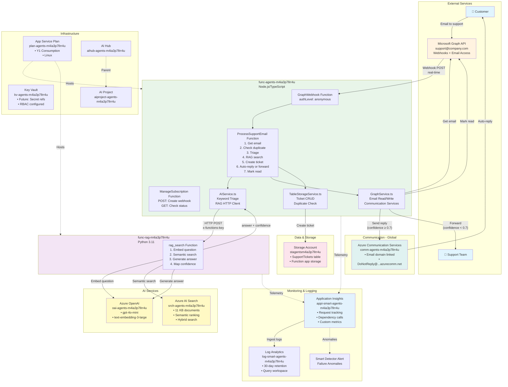
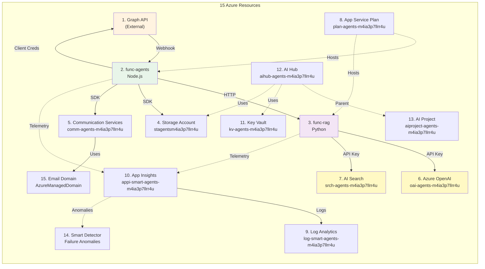
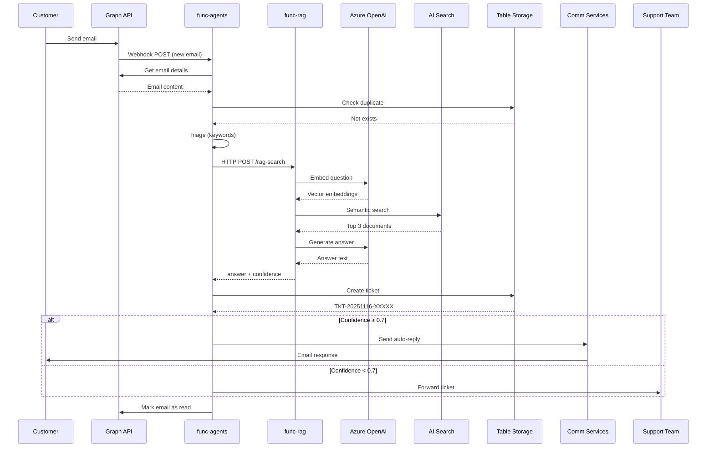
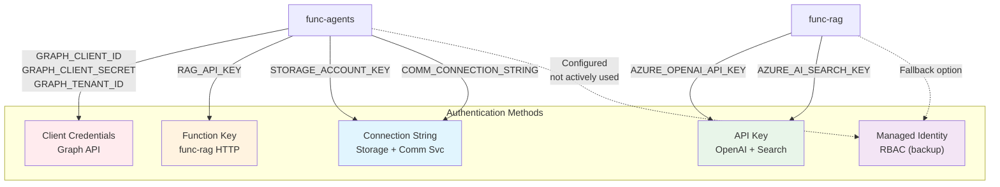
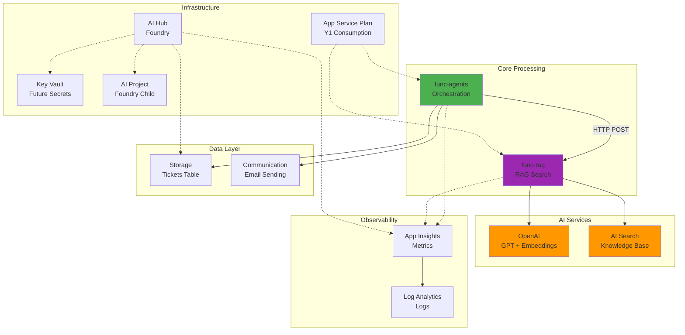

# Azure Smart Support Agent - Architecture Diagram

## System Overview - Mermaid Diagram

## Detailed Component Diagram

## Data Flow Sequence

## Authentication & Authorization

## Resource Dependencies

---

## Resource Summary Table

| # | Resource Name | Type | Location | Purpose |
|---|---------------|------|----------|---------|
| 1 | Microsoft Graph API | External | M365 Tenant | Email webhooks + mailbox access |
| 2 | func-agents-m4ia3p7llrr4u | Function App (Node.js) | Sweden Central | Orchestration, email processing |
| 3 | func-rag-m4ia3p7llrr4u | Function App (Python) | Sweden Central | RAG search endpoint |
| 4 | stagentsm4ia3p7llrr4u | Storage Account | Sweden Central | SupportTickets table, function storage |
| 5 | comm-agents-m4ia3p7llrr4u | Communication Services | Global | Email sending (auto-replies) |
| 6 | oai-agents-m4ia3p7llrr4u | Azure OpenAI | Sweden Central | GPT-4o-mini + embeddings |
| 7 | srch-agents-m4ia3p7llrr4u | AI Search | Sweden Central | Knowledge base (11 docs) |
| 8 | plan-agents-m4ia3p7llrr4u | App Service Plan | Sweden Central | Hosts both function apps |
| 9 | log-smart-agents-m4ia3p7llrr4u | Log Analytics | Sweden Central | Centralized log storage |
| 10 | appi-smart-agents-m4ia3p7llrr4u | Application Insights | Sweden Central | Telemetry + monitoring |
| 11 | kv-agents-m4ia3p7llrr4u | Key Vault | Sweden Central | Secret storage (future) |
| 12 | aihub-agents-m4ia3p7llrr4u | AI Hub | Sweden Central | AI Foundry container |
| 13 | aiproject-agents-m4ia3p7llrr4u | AI Project | Sweden Central | Prompt flow workspace |
| 14 | Failure Anomalies | Smart Detector Alert | Global | Anomaly detection |
| 15 | AzureManagedDomain | Email Domain | Global | Communication Services domain |

---
