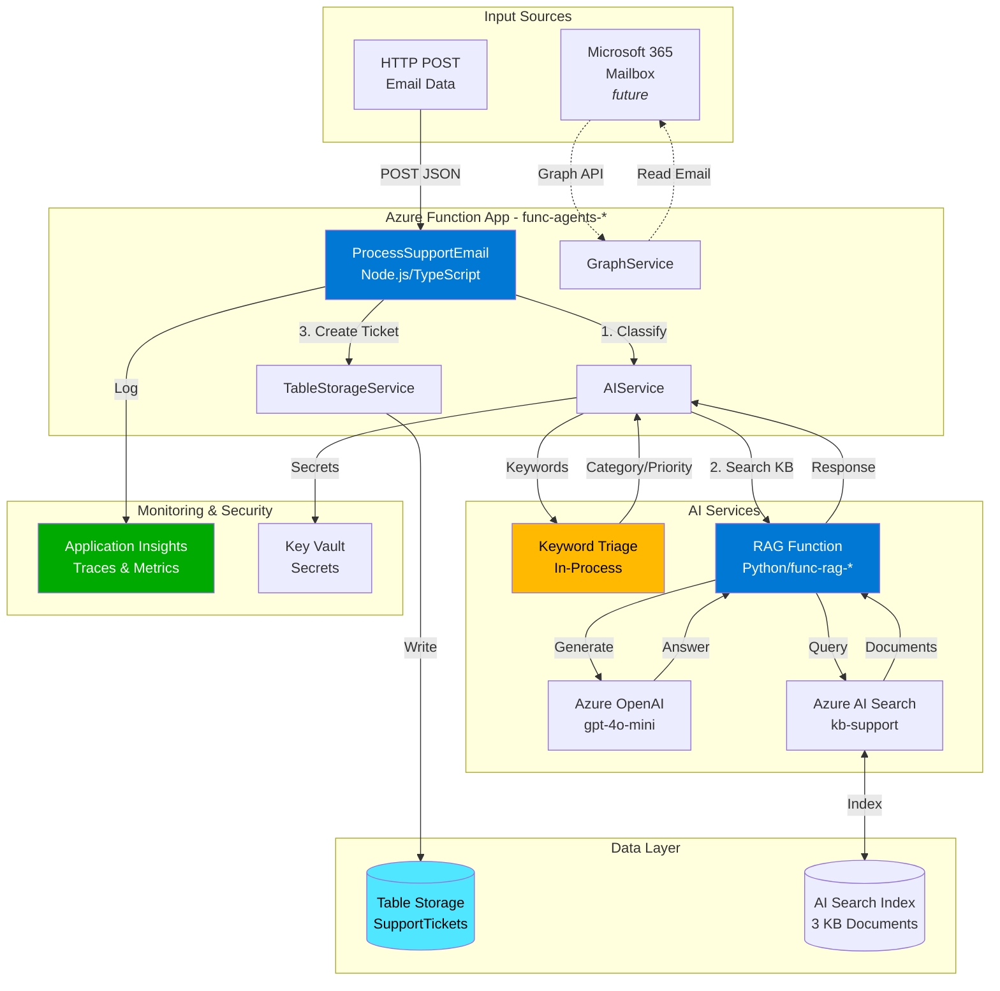
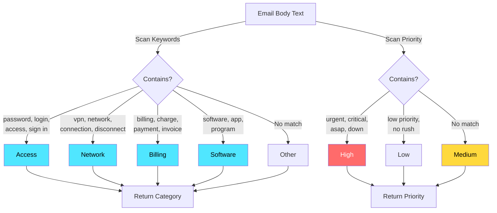
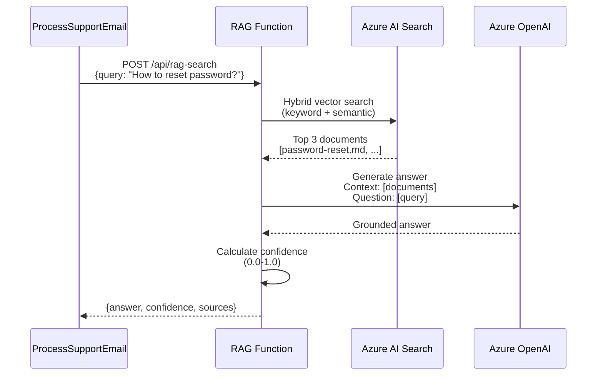
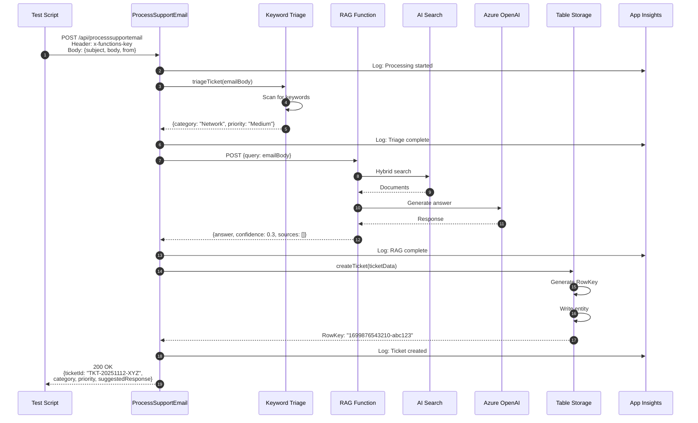
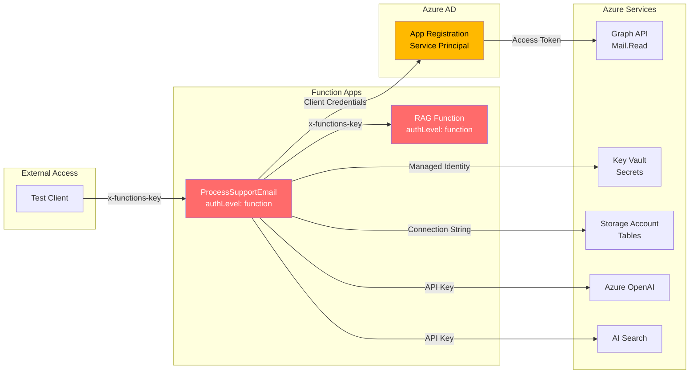
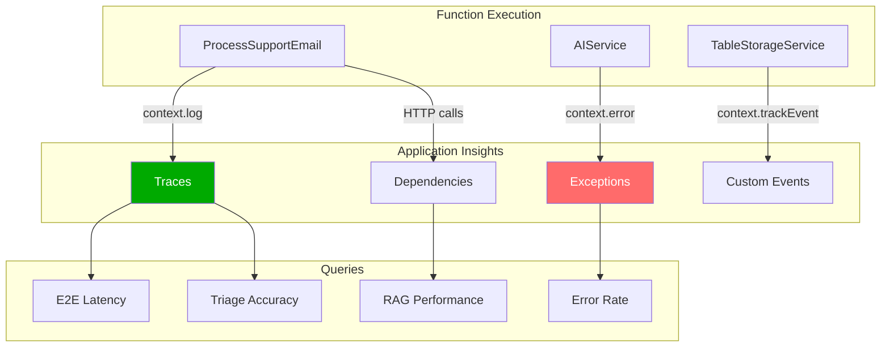

# System Architecture

## Overview

The Smart Support Agent system automates support ticket creation through a multi-stage pipeline that processes email requests, classifies them intelligently, searches knowledge bases for relevant information, and persists tickets with AI-generated responses.

## High-Level Architecture



## Component Details

### 1. Email Processing Function (`ProcessSupportEmail`)

**Technology**: Node.js 20, TypeScript, Azure Functions v4

**Responsibilities**:
- Accept email data via HTTP POST (simulation/test mode)
- Read unread emails from mailbox via Graph API (mailbox mode)
- Coordinate triage, RAG search, and storage operations
- Return ticket information and AI-generated responses

**Deployment**: `func-agents-dw7z4hg4ssn2k`

**Key Code**:
```typescript
// Supports both POST (direct) and GET (mailbox) modes
export async function ProcessSupportEmail(request, context) {
  const emailData = await request.json();
  
  // 1. Triage - classify category and priority
  const triage = await aiService.triageTicket(emailData.body);
  
  // 2. RAG Search - find relevant KB articles
  const rag = await aiService.searchKnowledgeBase(emailData.body);
  
  // 3. Create Ticket - persist to Table Storage
  const ticketId = await storageService.createTicket({
    Title: emailData.subject,
    Category: triage.category,
    Priority: triage.priority,
    AIResponse: rag.answer,
    Confidence: rag.confidence
  });
  
  return { ticketId, ...triage, ...rag };
}
```

### 2. Triage Service (Keyword-Based)

**Technology**: TypeScript (in-process)

**Classification Logic**:



**Accuracy**: 100% on test scenarios (VPN → Network, Password → Access, Billing → Billing)

**Future Enhancement**: Replace with Azure OpenAI-based classification or Prompt Flow deployment

### 3. RAG Search Service

**Technology**: Python 3.11, Azure Functions

**Flow**:



**Deployment**: `func-rag-dw7z4hg4ssn2k`

**Knowledge Base**:
- `billing-guide.md` - Billing procedures and payment FAQs
- `password-reset.md` - Step-by-step password reset instructions
- `vpn-troubleshooting.md` - VPN connection diagnostics

**Index Settings**:
- Hybrid search (vector + BM25)
- Semantic ranking enabled
- Text embedding: `text-embedding-3-large` (3072 dimensions)

### 4. Table Storage Service

**Technology**: Azure Table Storage SDK

**Table Schema**: `SupportTickets`

| Field | Type | Description |
|-------|------|-------------|
| PartitionKey | String | Date (YYYYMMDD) |
| RowKey | String | Timestamp-RandomID |
| TicketID | String | TKT-YYYYMMDD-XXXXXX |
| Title | String | Email subject |
| Description | String | Email body (truncated to 5000 chars) |
| Category | String | Access, Network, Billing, Software, Other |
| Priority | String | High, Medium, Low |
| Status | String | New, AI Resolved, Needs Human Review |
| CustomerEmail | String | From address |
| AIResponse | String | Generated answer from RAG |
| Confidence | Number | 0.0-1.0 |
| CreatedAt | DateTime | Timestamp |

**Example Query**:
```powershell
az storage entity query \
  --table-name SupportTickets \
  --account-name stagentsdw7z4hg4ssn2k \
  --filter "PartitionKey eq '20251112'" \
  --select TicketID,Category,Priority
```

### 5. Microsoft Graph Integration

**Status**: ✅ Configured, ⏳ Not Yet Active

**Purpose**: Read unread emails from support mailbox

**Configuration**:
- App Registration: `f2b47ff8-c292-4231-9365-a607f2689c43`
- Required Permissions: `Mail.Read`, `Mail.ReadWrite`
- Authentication: Client credentials flow

**To Activate**:
1. Set `SUPPORT_EMAIL_ADDRESS` in function app settings
2. Grant mailbox access to service principal
3. Switch endpoint to GET mode or run on timer trigger

## Data Flow

### Complete Request Flow



## Security Architecture

### Authentication & Authorization



**Security Controls**:
- Function keys required for HTTP endpoints
- Managed Identity for Key Vault access
- Connection strings stored in Key Vault
- HTTPS only
- CORS restrictions (production)

### Secrets Management

| Secret | Storage | Access Method |
|--------|---------|---------------|
| GRAPH_CLIENT_SECRET | Bicep `@secure()` | Function app settings |
| STORAGE_ACCOUNT_KEY | Bicep (auto-generated) | Function app settings |
| RAG_API_KEY | Manual configuration | Function app settings |
| AZURE_AI_SEARCH_API_KEY | Key Vault | Managed Identity |
| Function Keys | Azure Functions platform | Portal / CLI |

## Monitoring & Observability

### Application Insights Integration



**Key Metrics**:
- Request duration (P50, P95, P99)
- Success rate
- Triage classification distribution
- RAG confidence scores
- Table Storage write latency

**Sample KQL Query**:
```kql
traces
| where timestamp > ago(1h)
| where operation_Name == "ProcessSupportEmail"
| project timestamp, message, severityLevel
| order by timestamp desc
```

## Deployment Architecture

### Resource Organization

```
Azure Subscription
└── rg-smart-agents-dev (Sweden Central)
    ├── oai-agents-dw7z4hg4ssn2k (OpenAI)
    ├── srch-agents-dw7z4hg4ssn2k (AI Search)
    ├── func-agents-dw7z4hg4ssn2k (Function App - Node.js)
    ├── func-rag-dw7z4hg4ssn2k (Function App - Python)
    ├── stagentsdw7z4hg4ssn2k (Storage Account)
    ├── aihub-agents-dw7z4hg4ssn2k (AI Hub)
    ├── aiproject-agents-dw7z4hg4ssn2k (AI Project)
    ├── appi-smart-agents-dw7z4hg4ssn2k (App Insights)
    ├── kv-agents-dw7z4hg4ssn2k (Key Vault)
    └── plan-agents-dw7z4hg4ssn2k (App Service Plan)
```

### Infrastructure as Code

All resources defined in Bicep:
- `infra/main.bicep` - Orchestration
- `infra/modules/*.bicep` - Individual resource modules
- `infra/parameters.dev.json` - Environment-specific values

**Key Bicep Patterns**:
```bicep
// Secure parameters
@secure()
param graphClientSecret string

// Auto-generated values
var uniqueSuffix = uniqueString(resourceGroup().id)
var functionAppName = 'func-agents-${uniqueSuffix}'

// Managed Identity assignment
identity: {
  type: 'SystemAssigned'
}
```

## Performance Characteristics

### Latency Breakdown

| Stage | Typical Duration | Notes |
|-------|------------------|-------|
| Function cold start | 3-5s | First request or after scaling |
| Function warm request | 50-100ms | Subsequent requests |
| Keyword triage | 1-2ms | In-memory regex |
| RAG search | 500-1500ms | Search + OpenAI generation |
| Table Storage write | 50-100ms | Single entity |
| **Total (warm)** | **600-1700ms** | End-to-end |
| **Total (cold)** | **3.5-6.5s** | Including cold start |

### Scalability

- **Function Apps**: Consumption plan, auto-scale to 200 instances
- **Azure OpenAI**: 120K tokens/minute quota
- **AI Search**: Standard tier, 3 replicas
- **Table Storage**: 20,000 requests/second per partition

**Partition Strategy**:
- PartitionKey = Date (YYYYMMDD)
- Ensures even distribution across days
- Supports efficient time-range queries

## References

- [Azure AI Foundry Documentation](https://learn.microsoft.com/azure/ai-studio/)
- [Azure Functions Best Practices](https://learn.microsoft.com/azure/azure-functions/functions-best-practices)
- [Azure AI Search Hybrid Search](https://learn.microsoft.com/azure/search/hybrid-search-overview)
- [Azure Table Storage Design Patterns](https://learn.microsoft.com/azure/storage/tables/table-storage-design-patterns)
