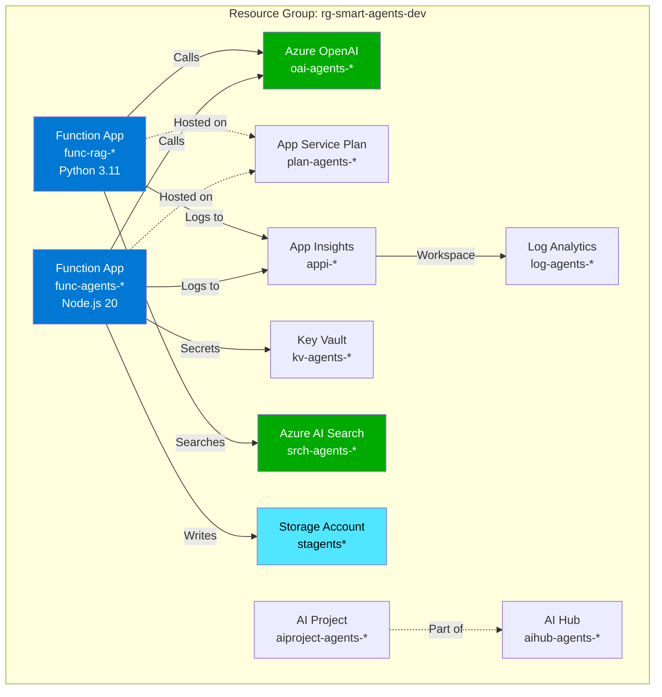
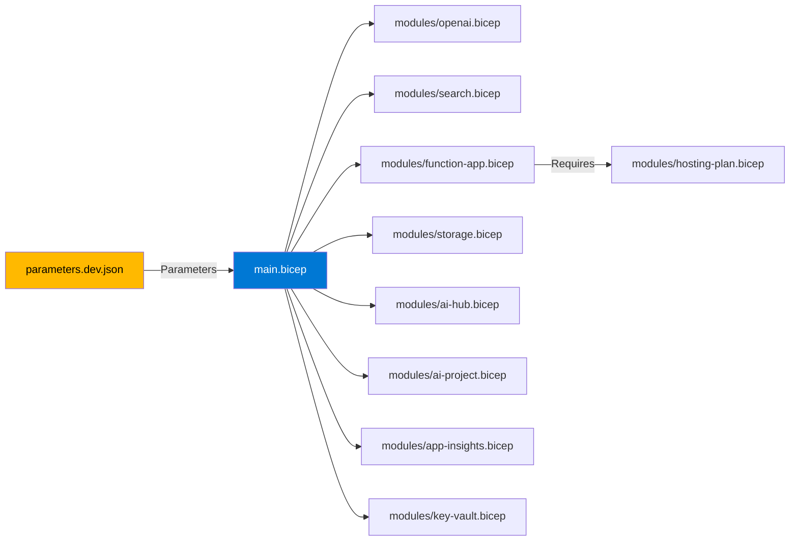

# Infrastructure Deployment

This directory contains Bicep templates for deploying all Azure resources required for the Smart Support Agent.

## Deployed Resources (Sweden Central)



### Resource Details

| Resource | Type | SKU | Purpose |
|----------|------|-----|---------|
| `oai-agents-*` | Azure OpenAI Service | S0 | GPT-5.1-chat, text-embedding-3-large deployments |
| `srch-agents-*` | Azure AI Search | Standard S1 | Knowledge base indexing with vector search |
| `func-agents-*` | Function App (Node.js 20) | Consumption | Email processing, triage, ticket creation |
| `func-rag-*` | Function App (Python 3.11) | Consumption | RAG search with AI Search integration |
| `stagents*` | Storage Account | Standard LRS | Table Storage for tickets |
| `aihub-agents-*` | AI Hub | - | Unified AI management workspace |
| `aiproject-agents-*` | AI Project | - | Project-level AI configurations |
| `appi-*` | Application Insights | - | Telemetry and monitoring |
| `kv-agents-*` | Key Vault | Standard | Secure secrets storage |
| `log-agents-*` | Log Analytics | Pay-as-you-go | Centralized logging |
| `plan-agents-*` | App Service Plan | B1 (Linux) | Hosting for function apps |

**Region**: Sweden Central (GPT-5.1-chat availability)

## Architecture



## Deployment

### Prerequisites

- Azure subscription with appropriate permissions
- Azure CLI 2.50+ or Azure PowerShell
- Bicep CLI (included with Azure CLI)

### Quick Deployment

```powershell
# Login to Azure
az login
az account set -s <subscription-id>

# Deploy all resources
az deployment sub create \
  --name smart-agents-deployment \
  --location eastus \
  --template-file main.bicep \
  --parameters @parameters.dev.json

# Get outputs
az deployment sub show \
  --name smart-agents-deployment \
  --query properties.outputs -o table
```

### Deployment Time

- **Total**: ~8-12 minutes
- AI Search: 3-4 minutes
- OpenAI Service: 2-3 minutes
- Function Apps: 2-3 minutes
- Other resources: 2-3 minutes

## Configuration

### Parameters File (`parameters.dev.json`)

```json
{
  "$schema": "https://schema.management.azure.com/schemas/2019-04-01/deploymentParameters.json#",
  "contentVersion": "1.0.0.0",
  "parameters": {
    "environment": { "value": "dev" },
    "location": { "value": "swedencentral" },
    "graphClientId": { "value": "<app-registration-id>" },
    "graphClientSecret": { "value": "<app-registration-secret>" },
    "graphTenantId": { "value": "<tenant-id>" }
  }
}
```

### Secure Parameters

Sensitive values use `@secure()` decorator:

```bicep
@secure()
param graphClientSecret string
```

These are not logged or exposed in deployment history.

After deployment, extract the outputs and add them to your `.env` file:

```bash
# Get the deployment outputs
az deployment sub show \
  --name smart-agents-deployment \
  --query properties.outputs -o json > outputs.json

# Manually copy values to .env or use this script:
# (Create scripts/export-outputs.sh for automation)
```

Example `.env` from outputs:

```env
AZURE_AI_SEARCH_ENDPOINT=<searchEndpoint.value>
AZURE_AI_SEARCH_API_KEY=<searchAdminKey.value>
APPINSIGHTS_CONNECTION_STRING=<appInsightsConnectionString.value>
AZURE_STORAGE_CONNECTION_STRING=<storageConnectionString.value>
AZURE_FUNCTION_APP_URL=<functionAppUrl.value>
AZURE_KEY_VAULT_URI=<keyVaultUri.value>
```

## Updating Parameters

Edit `parameters.dev.json` to customize:

- `location` - Azure region (default: eastus)
- `environmentName` - Environment suffix (dev, staging, prod)

## Clean Up

To delete all resources:

```bash
# Delete the resource group
az group delete --name rg-smart-agents-dev --yes --no-wait
```

## Module Structure

```
infra/
├── main.bicep                    # Main template (subscription scope)
├── parameters.dev.json           # Development parameters
└── modules/
    ├── search.bicep              # Azure AI Search
    ├── storage.bicep             # Storage Account
    ├── log-analytics.bicep       # Log Analytics Workspace
    ├── app-insights.bicep        # Application Insights
    ├── hosting-plan.bicep        # App Service Plan
    ├── function-app.bicep        # Function App
    └── key-vault.bicep           # Key Vault
```
